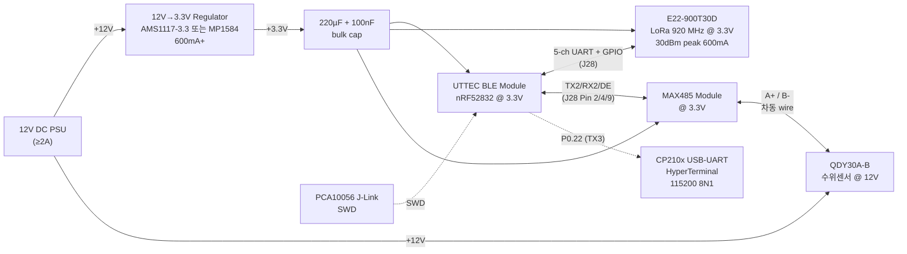

# 한림용인CC 수조 sensing test — 2026-06-02 (화) 준비 자료

## 테스트 목적

QDY30A-B 수위센서가 실 수조 환경 (담수, 1.5m PVC 파이프 또는 양동이)에서 정상 측정값을 출력하는지 검증. 양산 PCB 설계 (6/8경 입고) 전 마지막 통신 + 전원 검증.

**검증 범위**:
- ✅ 전원 chain (12V → 3.3V → 각 모듈) 안정성
- ✅ MAX485 + RS485 wire 차동 통신 정상 동작
- ✅ TX2/RX2 + DE 제어로 Modbus query → response 왕복
- ✅ 침수 깊이별 raw 값 변화 (단위 확정, ZeroPoint 보정 검증)
- ⭐ 5/31 SW-UART glitch 가설 검증 (MAX485 차동이 자연 필터링)

---

## 장비 List

| # | 항목 | 모델 | 비고 |
|:-:|---|---|---|
| 1 | 수위센서 | QDY30A-B RS485 (6개 중 #0~#4 양품, #5 +3 offset) | 5/31 검증 완료 |
| 2 | nRF52832 보드 | UTTEC BLE Module v1 | J28 14-pin 풀 매핑 |
| 3 | J-Link OB | PCA10056 (SN 683795210) | SWD 디버그/플래시 |
| 4 | LoRa 모듈 | E22-900T30D 30dBm | + 920 MHz SMA 안테나 (필수) |
| 5 | RS485 트랜시버 | MAX485 / MAX3485 모듈 (3.3V) | DE+RE 핀 묶음 |
| 6 | 전원 | 12V DC 어댑터 (≥2A) | 또는 12V SMPS |
| 7 | 12V→3.3V 변환 | AMS1117-3.3 모듈 또는 MP1584 buck | 600mA+ (E22 burst 대응) |
| 8 | bulk capacitor | 220µF 전해 (3.3V rail) + 100nF 세라믹 | E22 burst noise 흡수 |
| 9 | USB-UART (debug) | CP210x (J28 Pin 7=P0.22 TX3 모니터) | HyperTerminal 115200 |
| 10 | 측정 환경 | PVC 파이프 1.5m 또는 양동이 50cm | 0/10/30/50/100/150 cm 단계 |
| 11 | 측정 자 | 줄자 또는 막대 | mm 단위 |
| 12 | 멀티미터 | DC V / continuity | 전원 + GND continuity 검증 |

---

## 시스템 Block Diagram



**핵심 분리**:
- **12V rail**: PSU → 센서 직접 / Regulator 입력 (sensor와 MCU stack 전원 격리는 GND만 공통)
- **3.3V rail**: Regulator 출력 → BLE Module + E22 + MAX485 (공통)
- **차동 wire**: MAX485 A+/B- ↔ 센서 A+/B- (Twisted pair 권장, 짧으면 단선 OK)

---

## 결선 상세 (Pin-by-Pin)

### 1. 전원 (Power Distribution)

| 신호 | from | to | 비고 |
|---|---|---|---|
| +12V | PSU + | Regulator IN, Sensor Red | sensor는 12V 직접 |
| GND | PSU − | Regulator GND, Sensor Green, **공통 GND rail** | ⭐ 모든 GND 한 점 묶음 |
| +3.3V | Regulator OUT | bulk cap +, BLE J23 Pin 1, E22 VCC, MAX485 VCC | bulk cap을 OUT 근처에 배치 |
| GND (3.3V side) | Regulator GND | bulk cap −, BLE J23 Pin 4, E22 GND, MAX485 GND | 12V GND와 공통 |

⚠️ **GND 공통 필수**: sensor·MCU stack·USB-UART·J-Link 모두 한 점 GND 안 묶으면 통신 깨짐 (5/31 박제).

### 2. UTTEC BLE Module ↔ E22 LoRa Module

| BLE J28 Pin | port | E22 핀 | 역할 |
|:-:|:-:|---|---|
| 1 | P0.11 (TX1) | RXD | UART TX (MCU → E22) |
| 3 | P0.13 (RX1) | TXD | UART RX (MCU ← E22) |
| 6 | P0.17 | M0 | mode bit 0 (Normal=0) |
| 8 | P0.19 | M1 | mode bit 1 (Normal=0) |
| 10 | P0.20 | AUX | busy signal (input pullup) |
| 11 | 3.3V | VCC | 전원 |
| 13 | GND | GND | 전원 |

⚠️ **E22 운용 전 사전 설정 필요** (EBYTE Software로):
- REG0 = **0x60** (baud 9600 / air 0.3 kbps) — 본 펌웨어는 9600 가정
- REG2 = **0x48** (CH 72 = 922.125 MHz Korea KC)
- REG3 = 0x00 (RSSI byte OFF)

상세: `firmware/README.md` "E22 모듈 사전 설정" 섹션 (2026-05-19 박제).

### 3. UTTEC BLE Module ↔ MAX485 Module ⭐ (본 테스트 핵심)

| BLE J28 Pin | port | MAX485 핀 | 역할 |
|:-:|:-:|---|---|
| 2 | P0.15 (TX2) | DI (Driver Input) | UART TX → RS485 wire로 변환 |
| 4 | P0.02 (RX2) | RO (Receiver Output) | RS485 wire → UART RX로 변환 |
| 9 | P0.24 | DE+RE (묶음) | 방향 제어 (HIGH=TX, LOW=RX) |
| 11 | 3.3V | VCC | MAX485 전원 (3.3V variant) |
| 13 | GND | GND | 전원 |

⚠️ **DE+RE 묶음**: 대부분 MAX485 모듈이 DE와 RE를 1핀으로 묶어 한 GPIO로 제어 가능. 분리된 경우 둘 다 P0.24에 연결.

⚠️ **DE 제어 timing 중요** (Modbus master 펌웨어 구현 시):
- query 송신 전 → DE HIGH
- query 마지막 byte 송신 완료 직후 → DE LOW (sensor 응답 대기)
- 응답 수신 완료 후 → 다시 DE HIGH (다음 query 준비)
- 현재 펌웨어는 DE 정적 HIGH (`main.c` line 121) — Modbus master 구현 시 동적 제어 필요

### 4. MAX485 Module ↔ QDY30A-B 센서

| MAX485 | 센서 wire 색 | 역할 |
|---|---|---|
| A | **Blue (A+)** | RS485 non-inverting |
| B | **Yellow (B−)** | RS485 inverting |
| — | Red | +12V (별도 PSU 라인) |
| — | Green | GND (공통 GND rail) |

⚠️ **A/B 스왑 위험**: 일부 lot은 A/B 반대. 5/31 본 lot 6개 모두 Blue=A+, Yellow=B− 확정. 새 lot은 다를 수 있음.

옵션: A-B 사이에 120Ω termination resistor (긴 wire 시 필수, <5m 단선은 생략 가능).

---

## 12V→3.3V Regulator 선택 (E22 burst 대응)

E22 30 dBm TX 시 peak 600 mA. Regulator 선택 기준:

| 옵션 | 효율 | Peak | 발열 | 권장도 |
|---|:-:|:-:|---|:-:|
| **AMS1117-3.3** (LDO) | 낮음 (선형) | 1A | (12-3.3)×0.6 = 5.2W = 뜨거움 | ⚠️ 방열판 필수 |
| **MP1584 / MP2307** (buck) | 90%+ | 3A | 미미 | ✅ 권장 |
| LM2596 buck | 80% | 3A | 약간 | ✅ OK |

**권장**: MP1584 또는 LM2596 buck 모듈 (시중 흔함, ~3,000원). 출력 3.3V 미세 조정 가능 (트림 가변저항).

**Bulk capacitor**: 220µF 전해 + 100nF 세라믹을 3.3V rail에 병렬. **E22 VCC 핀 바로 옆에 배치** (burst noise 흡수). 없으면 E22 TX 시 BLE Module reset 가능.

---

## Modbus RTU 통신 사양 (QDY30A-B)

### 통신 파라미터

| 항목 | 값 |
|---|---|
| Baud | 9600 |
| Data | 8 |
| Parity | N |
| Stop | 1 |
| Slave Address | **0x01** (5/31 6개 모두 동일) |
| Function Code | 0x03 (Read Holding Registers) |

### Register Map (5/31 검증)

| Register | 의미 | 값 (6개 중 #0~#4) | 값 (#5 outlier) |
|:-:|---|:-:|:-:|
| 0x0000 | Slave Address | 1 | 1 |
| 0x0001 | Baud Code | 3 (=9600) | 3 |
| 0x0002 | Unit | 17 (비표준, OEM 인코딩) | 17 |
| 0x0003 | Decimal | 1 | 1 |
| 0x0004 | **Level (raw)** ⭐ | 0 (공기 중) | 3 (offset) |
| 0x0005 | ZeroPoint | 0 | 0 |
| 0x0006 | RangeFull | 3000 | 3000 |

### Query — 수위 raw 읽기

**Query bytes** (Master → Sensor):
```
01 03 00 04 00 01 C5 CB
```
- `01` = slave addr
- `03` = FC Read Holding Registers
- `00 04` = start register (0x0004 = Level)
- `00 01` = 읽을 register 수 (1개)
- `C5 CB` = CRC16 (Modbus, little-endian)

⚠️ CRC는 query 내용 변경 시 재계산 필요. Python `pymodbus` 또는 [online Modbus CRC calculator](https://www.lammertbies.nl/comm/info/crc-calculation) 활용.

### Expected Response — 공기 중

**Response bytes** (Sensor → Master) — Level = 0 (양품):
```
01 03 02 00 00 B8 44
```
- `01 03` = echo slave+FC
- `02` = byte count (=2)
- `00 00` = register value (level raw = 0)
- `B8 44` = CRC16

**#5 sensor의 경우** (Level = 3, +3 offset):
```
01 03 02 00 03 79 85
```

### Expected Response — 침수 시

침수 깊이별 raw 값 (단위 미확정, 5/31 측정 안 됨 → 6/2 본 테스트로 확정):

| 침수 깊이 | 예상 raw (단위 가설) | 비고 |
|:-:|:-:|---|
| 0 cm (공기) | 0~3 | (sensor별 offset) |
| 10 cm | ? | RangeFull=3000 / 단위가 cm면 100, mm면 100, 0.1cm면 10 |
| 30 cm | ? | |
| 50 cm | ? | |
| 100 cm | ? | |
| 150 cm | ? | RangeFull 3000이 3m라면 1500 |

⭐ **단위 확정 핵심**: 100 cm 시 raw=100이면 cm 단위, raw=1000이면 mm, raw=10이면 mm×10 (0.1cm scale)

### ZeroPoint 보정 write (선택, #5 sensor)

`#5` sensor를 깊이 매핑에 쓰려면 ZeroPoint에 -3 write:

**Query bytes** (Master → Sensor):
```
01 06 00 05 FF FD [CRC_lo] [CRC_hi]
```
- `01 06` = slave + FC 0x06 (Write Single Register)
- `00 05` = register 0x0005 (ZeroPoint)
- `FF FD` = -3 (two's complement signed 16-bit)
- CRC 별도 계산

write 후 다시 Level read → 0이 되어야 함.

---

## 테스트 시퀀스 (단계별)

### Phase 1: 전원 검증 (5분)

1. **전원 OFF 상태에서 결선 완료**
2. 멀티미터로 continuity 확인:
   - GND rail 모든 점 (sensor Green, MCU GND, MAX485 GND, USB-UART GND) 연결됨 ✓
   - 12V 라인 short 없음 (12V ↔ GND 저항 ≥10kΩ)
   - 3.3V 라인 short 없음
3. **E22 안테나 체결 확인** (안테나 없이 켜면 PA 손상 위험)
4. **PSU ON**:
   - 멀티미터로 12V rail = 12.0 ± 0.5V ✓
   - 3.3V rail = 3.30 ± 0.10V ✓
   - **3.3V rail이 낮으면**: Regulator load 과부하 또는 bulk cap 부족 → 즉시 OFF
5. BLE Module LED (D21 BLUE / D22 RED) 1Hz 토글 확인 → 펌웨어 정상 부팅

### Phase 2: TX3 디버그 채널 확인 (5분)

1. USB-UART (CP210x) → BLE Module J28 Pin 7 (P0.22 = TX3) + GND 공통
2. HyperTerminal 115200 8N1 연결
3. 출력 확인:
   ```
   UTTEC BLE Module 5-ch UART test
   TX1/RX1=9600  TX2=9600 (SPI1, 1 MHz)  RX2=9600  TX3=115200
   ...
   TX3: 0
   TX3: 1
   ...
   ```
4. ✅ 정상이면 펌웨어 + 전원 + TX3 path OK

### Phase 3: PC 기반 sensor 단독 검증 (10분, 5/31 재현)

⚠️ **MCU 펌웨어가 Modbus master 미구현 상태이면 PC로 먼저 검증**.

1. USB-RS485 동글 (CH340 COM44) 을 MAX485 자리에 연결 (또는 sensor 직결)
2. PC에서 `pc_test/qdy30a_single_measure.py` 실행:
   ```bash
   cd C:\todo\today\project\골프_수조_물관리\pc_test
   python qdy30a_single_measure.py --port COM44 --sensor-id 0
   ```
3. 공기 중 raw=0 확인 (5/31 검증값과 일치)
4. ✅ sensor + 결선 정상 → Phase 4 진행

### Phase 4: MCU + MAX485 통합 통신 (Modbus master 펌웨어 필요)

⚠️ 현재 펌웨어는 Modbus master 미구현. 둘 중 선택:

**옵션 A** (Quick): 현 펌웨어 TX2가 "TX2: N\r\n" 송신 → MAX485 → A+/B− 출력만 확인 (sensor 응답 없음). RS485 wire에 신호 흐름만 검증.

**옵션 B** (본격): Modbus master 추가 펌웨어 작성:
- DE HIGH → TX2로 query 8 byte 송신 → DE LOW (turnaround ~10 µs)
- RX2로 응답 7 byte 수신 → ring buffer
- 응답 parse + level raw 출력 (TX3 디버그)
- 1초 polling

옵션 B 펌웨어가 없으면 6/2 테스트는 옵션 A + Phase 3 (PC) 조합으로 진행.

### Phase 5: 침수 깊이 매핑 (15분, 최종 데이터)

⚠️ Phase 3 또는 Phase 4 통신 정상 확인 후 진행.

1. PVC 파이프 1.5m (또는 양동이 50cm) 에 물 채움
2. Sensor #0 또는 #1 (양품 영점 0) 사용
3. 0/10/30/50/100/(150) cm 단계별 침수:
   - 각 단계 30초 안정화 → 5초 raw 값 (22 sample) 측정
   - CSV 박제 (`pc_test/results/qdy30a_depth_map_2026-06-02.csv`)
4. raw 값 변화로 단위 확정 (cm vs mm vs 0.1cm)
5. 선형성 검증 (raw vs 실 깊이)

---

## 합격 기준

| 항목 | 합격 | 한계선 | 불합격 |
|---|---|---|---|
| 3.3V rail | 3.20~3.40V | 3.10~3.50V | <3.10 또는 >3.50V |
| Modbus 응답 시간 | <100 ms | 100~500 ms | timeout |
| 공기 raw | 0~3 | 0~10 | >10 (offset 큰 sensor) |
| 침수 raw 선형성 | R² > 0.99 | R² > 0.95 | R² < 0.95 |
| **5/31 글리치 가설 검증** | MAX485 통과 후 정상 통신 | — | MAX485 적용 후에도 깨짐 |

---

## Troubleshooting Checklist

### 증상별 대응

| 증상 | 가능 원인 | 조치 |
|---|---|---|
| 3.3V rail 2.5V 이하 | E22 burst 시 regulator 과부하 | bulk cap 증설, regulator 교체 (LDO→buck) |
| Sensor 응답 없음 (PC) | A/B 스왑 / GND 미공통 / sensor 전원 X | A/B 교환 시도, GND 점검, sensor red wire 12V 확인 |
| Sensor 응답 깨짐 | CRC 오류 / baud 불일치 / wire noise | CRC 재계산, baud 9600 확인, twisted pair 사용 |
| MCU 응답 없음 (옵션 B) | DE 전환 timing / TX2 wire | DE HIGH→LOW timing 펌웨어 점검, TX2→DI wire continuity |
| TX2 wire에 신호 안 보임 | TX2 펌웨어 빌드 안 됨 / DE LOW | HyperTerminal TX3로 펌웨어 동작 확인, DE 정적 HIGH 펌웨어 사용 |
| 침수 raw 변화 작음 | sensor 측정 범위 밖 / sealing 문제 | RangeFull 3000 확인, sensor 다이어프램 표면 청결 |
| 침수 raw가 사양과 다른 단위 | OEM 인코딩 (Unit register 17) | 100 cm 시 raw 값으로 단위 역산 |

### E22 모듈 안 켜질 시
- 안테나 미체결 → PA 손상 가능. 즉시 OFF + 안테나 체결 + 모듈 교체
- M0/M1 LOW 확인 (Normal mode)
- AUX HIGH 확인 (idle 상태)

---

## 안전 점검 (전원 ON 전 필수)

- [ ] E22 920 MHz SMA 안테나 체결됨 (안테나 없이 켜면 PA 손상)
- [ ] PSU polarity 정상 (+12V / GND 반대 연결 시 즉시 손상)
- [ ] 3.3V rail short 없음 (멀티미터 ≥10kΩ)
- [ ] GND 모든 점 공통 (continuity 확인)
- [ ] Sensor wire color 확인 (Red=+12V, Green=GND, Blue=A+, Yellow=B−)
- [ ] J-Link 결선 시 GND 먼저 → 그 다음 SWDIO/SWDCLK → 마지막 VTG

---

## 산출물 (테스트 후 박제)

테스트 결과는 다음 파일로 박제:
- `pc_test/results/qdy30a_depth_map_2026-06-02.csv` — 깊이별 raw 데이터
- `pc_test/results/qdy30a_depth_report_2026-06-02.md` — 분석 보고서
- `wiki/log.md` `## [2026-06-02] firmware | 수조 sensing test 결과`
- `wiki/thoughts/2026-Q2/2026-06-02_sensing-test-result.md` — 단위 확정, 글리치 가설 검증 결과, PCB 설계 영향

---

## 관련 자산

- `firmware/bleModule_uart_test/` — 5-channel UART bring-up 펌웨어 (현재 base)
- `pc_test/qdy30a_modbus_test.py` — Modbus dump/poll/scan/baud-scan 4 mode
- `pc_test/qdy30a_single_measure.py` — non-interactive 단발 측정 + CSV append
- `references/QDY30A-B_RS485_사양서.md` — sensor 사양 + register map
- `oldProject/test/bleModule/PINMAP.md` — J28 14-pin 풀 매핑
- `wiki/entities/uttec-ble-module.md` — 양산 보드 entity
- `wiki/thoughts/2026-Q2/2026-06-01_sw-uart-tx-debug-cp210x.md` — TX2 깨짐 fix 박제
- `firmware/README.md` — E22 LoRa 설정 + 빌드 환경 (5/19 작성)
