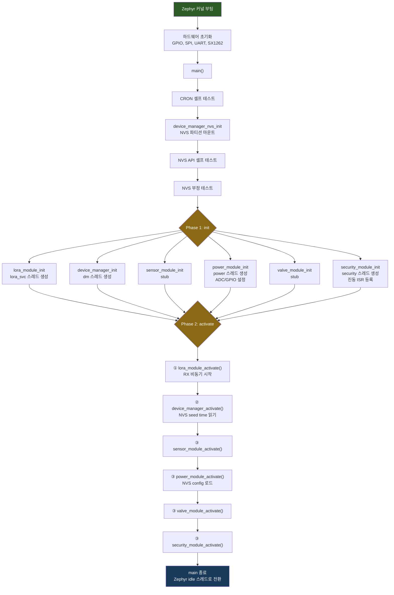
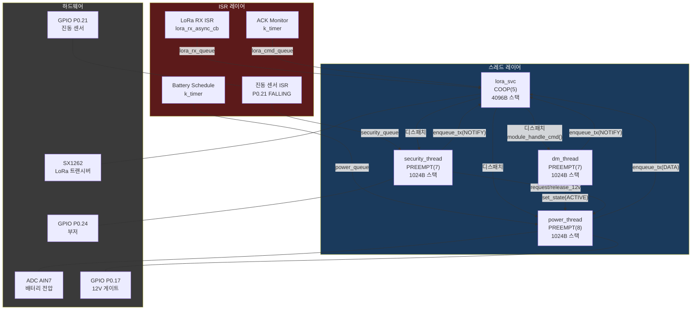
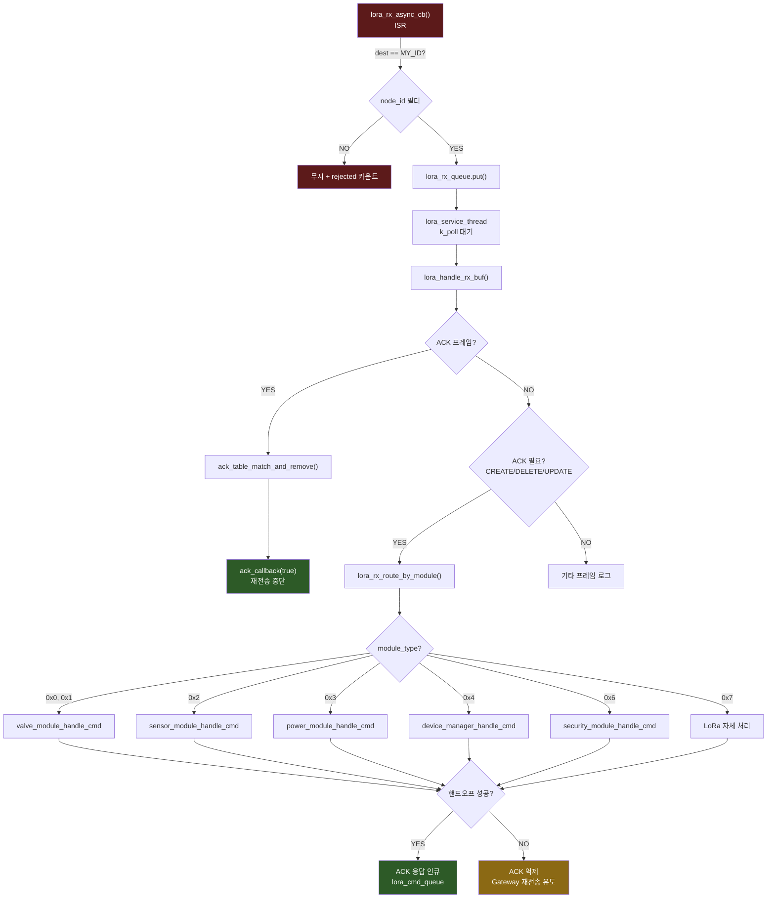
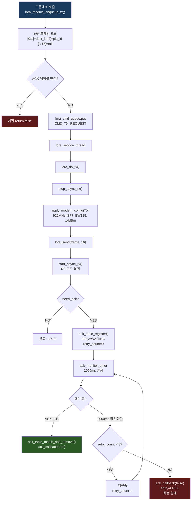
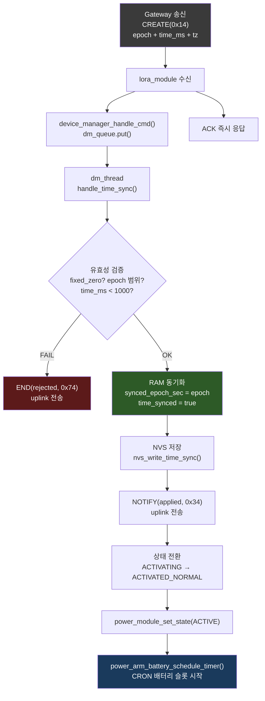
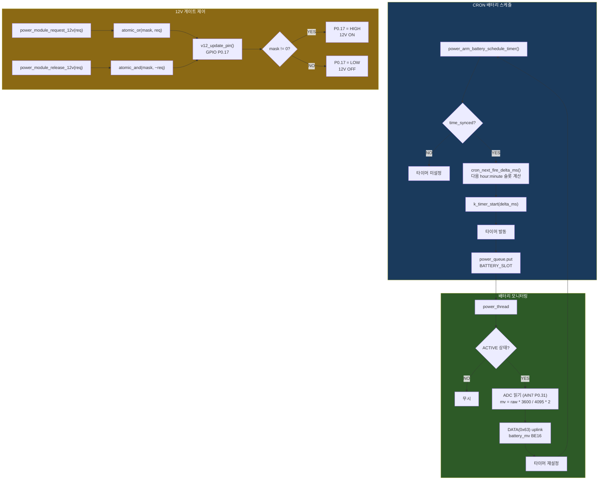
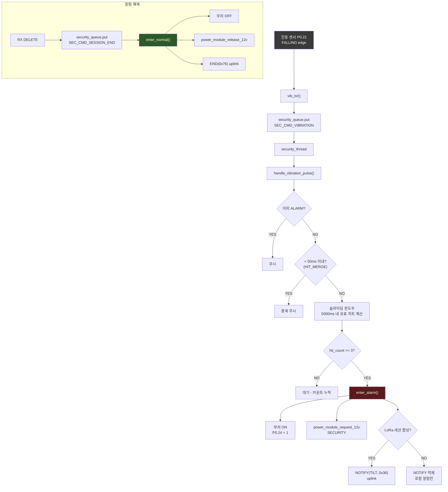
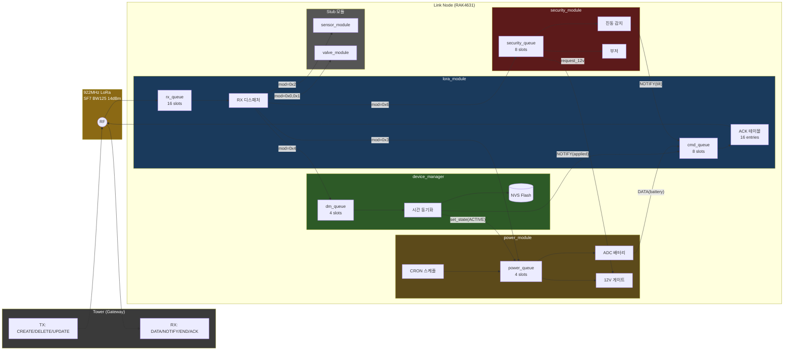

# System Project — 전체 Flow Chart

## Obsidian에서 보는 방법

### Vault 열기
1. Obsidian 실행
2. 좌하단 **Vault 이름** 클릭 → **"보관함 관리하기..."** 클릭
3. **"폴더를 보관함으로 열기"** 선택 → `C:\todo\revitaProject` 열기

### 다이어그램 보기
- **읽기 모드** (`Ctrl + E` 토글): Mermaid 다이어그램이 **그림으로 렌더링**됨
- **편집 모드** (`Ctrl + E` 토글): 코드 블록이 텍스트로 보임 (편집 가능)
- Mermaid는 Obsidian **기본 내장** 기능이므로 플러그인 설치 불필요

### 수정 방법
1. 편집 모드에서 ` ```mermaid ` 블록 안의 텍스트를 수정
2. 읽기 모드로 전환하면 변경사항 즉시 반영

### 이미지 내보내기
- 읽기 모드에서 다이어그램 위 **우클릭 → "이미지로 복사"** → 다른 문서에 붙여넣기 가능

---

## 1. 부팅 시퀀스



---

## 2. 모듈 구조도 (스레드 & 상호작용)



---

## 3. LoRa RX 수신 흐름



---

## 4. LoRa TX 송신 + ACK 재전송 흐름



---

## 5. Device Manager 시간 동기화 흐름



---

## 6. Power 모듈 — 배터리 모니터링 + 12V 제어



---

## 7. Security 모듈 — 진동 감지 + 알람



---

## 8. 전체 메시지 흐름 통합도



---

## 9. 프로토콜 프레임 구조 (16B 고정)

```
Byte:  0    1    2    3    4    5    6   ...   15
     +----+----+----+----+----+----+----+---+----+
     |dest_node_id |pkt |type|         body        |
     |  (BE u16)   | id |mod |     (12 bytes)      |
     +----+----+----+----+----+----+----+---+----+
```

### 구현된 메시지 타입

| 메시지 | type_mod | 방향 | body 내용 |
|--------|----------|------|-----------|
| DATA battery | 0x63 | Link→Tower | [4-5] battery_mv (BE16) |
| ACK power | 0x03 | Tower→Link | 전부 0 |
| CREATE sensor | 0x12 | Tower→Link | [4] device_index |
| ACK sensor | 0x02 | Link→Tower | 전부 0 |
| CREATE DM | 0x14 | Tower→Link | epoch + time_ms + tz |
| NOTIFY applied | 0x34 | Link→Tower | 상태 확인 |
| END rejected | 0x74 | Link→Tower | 거부 사유 |
| NOTIFY security | 0x36 | Link→Tower | event_code |
| END security | 0x76 | Link→Tower | end_reason |

---

## 10. 핀 맵 (RAK4631 / nRF52840)

| 기능 | 핀 | 방향 |
|------|-----|------|
| Debug TX | P0.16 | OUT |
| Debug RX | P0.15 | IN |
| RS485 TX | P0.20 | OUT |
| RS485 RX | P0.19 | IN |
| RS485 DE | P1.04 | OUT |
| RS485 RE# | P1.03 | OUT |
| 12V Enable | P0.17 | OUT |
| Buzzer | P0.24 | OUT |
| Battery ADC | P0.31 (AIN7) | IN |
| Vibration | P0.21 | IN |
| Valve X A/B/PWM | P0.14/P0.13/P0.04 | OUT |
| Valve Y A/B/PWM | P0.25/P1.01/P1.02 | OUT |

---

*생성일: 2026-04-20*
*소스: apps/system/src/ (10개 파일)*
