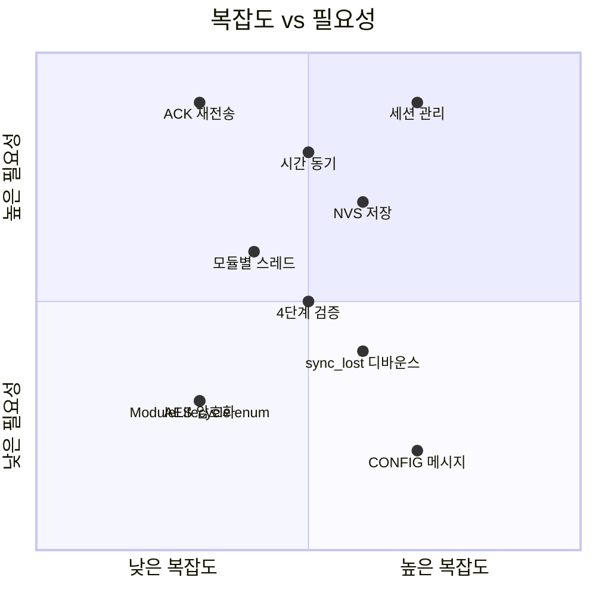

# 왜 이 아키텍처인가 — 복잡도 근거 분석

> "이렇게 복잡한 프로토콜과 방식으로 진행해야만 하나요?"

이 문서는 현재 REVITA 시스템의 설계 복잡도가 **과잉인지, 필요한 것인지**를 분석한다.

---

## 1. 현재 복잡도 요약

| 영역 | 현재 사양 | 복잡도 |
|------|-----------|--------|
| 프로토콜 | 16B 고정 프레임, 13종 타입, 7종 모듈, AES-128, CRC16 | **높음** |
| 세션 관리 | CREATE/DELETE/NOTIFY/END 상태머신 per 모듈 | **높음** |
| NVS | 모듈별 blob, magic/version/CRC-32 검증 | **높음** |
| 부팅 | 2단계 (init/activate), ModuleLifecycle enum | **중간** |
| 스레드 | 모듈별 독립 스레드 + 큐 (6개) | **중간** |
| 시간 동기 | 4단계 검증, sync_lost, 디바운스 | **높음** |
| Power | 12V 게이트, CRON 슬롯, NVS 레지스터 맵, RF 세션 | **높음** |

---

## 2. 단순한 대안은 없었는가?

### 대안 A: "센서 읽고 바로 보내기"

```
매 10분:
  RS485 센서 읽기 → LoRa 패킷 조립 → 송신 → 슬립
```

| 장점 | 단점 |
|------|------|
| 코드 100줄이면 됨 | 서버가 명령을 내릴 수 없음 |
| 디버깅 쉬움 | 밸브 제어 불가 (단방향) |
| 즉시 동작 | 시간 기반 스케줄링 불가 |
| | 장애 시 상태 파악 불가 |
| | 설정 변경 시 펌웨어 재플래시 필요 |

**판단**: 센서 데이터 수집만 한다면 이것으로 충분하다. 그러나 **REVITA는 관수 제어 시스템**이다 — 밸브를 열고 닫아야 한다. 단방향 통신으로는 불가능.

### 대안 B: "간단한 명령/응답"

```
Tower: CMD_READ_SENSOR → Link: RESP_DATA
Tower: CMD_OPEN_VALVE  → Link: RESP_OK
```

| 장점 | 단점 |
|------|------|
| 이해하기 쉬움 | 모듈 구분 없이 플랫 구조 → 코드 혼잡 |
| 양방향 가능 | 상태 관리 없음 → 밸브가 열린 채 통신 끊기면? |
| | 시간 동기 없음 → CRON 스케줄링 불가 |
| | 설정 변경 프로토콜 없음 |
| | 장애 복구 메커니즘 없음 |

**판단**: 프로토타입에는 적합하나, **무인 현장 장기 운용에는 위험**하다.

### 대안 C: "기존 프로토콜 사용 (LoRaWAN, MQTT-SN)"

| 장점 | 단점 |
|------|------|
| 표준 프로토콜 | LoRaWAN: 게이트웨이 인프라 필요 (비용) |
| 검증된 보안 | LoRaWAN: 10B 페이로드에 오버헤드 큼 |
| 에코시스템 활용 | MQTT-SN: LoRa 위에서 신뢰성 보장 어려움 |
| | 모듈별 세션 관리는 어차피 자체 구현 필요 |

**판단**: LoRaWAN은 데이터 수집에 좋지만, **양방향 제어 + 모듈별 세션 관리**에는 커스텀이 불가피.

---

## 3. 왜 이 복잡도가 필요한가

### 3.1 양방향 제어 (밸브/펌프)

```
단순 수집: Link → Tower (단방향) → 프로토콜 간단
관수 제어: Tower ↔ Link (양방향) → 프로토콜 필수
```

밸브를 원격으로 열고 닫으려면:
- Tower가 Link에 **명령**을 보내야 함
- Link가 **ACK/결과**를 보내야 함
- 명령이 실패하면 **재전송**해야 함
- **이것만으로도 ACK + 재전송 + 타임아웃 메커니즘이 필수**

### 3.2 안전 (2시간 런어웨이 컷오프)

밸브가 열린 상태에서 통신이 끊기면?
- **세션 관리 없이**: 밸브가 영원히 열려있음 → 농지 침수
- **세션 관리 있으면**: DELETE 타임아웃 → 자동 닫힘

```
CREATE(valve) → 밸브 열림 → ... 통신 끊김 ...
  → 세션 타임아웃 → 자동 DELETE → 밸브 닫힘 → 안전
```

**이것이 CREATE/DELETE/END 세션 모델의 핵심 이유.**

### 3.3 시간 동기 (CRON 스케줄링)

"매일 06:00, 18:00에 센서 측정" → 시간이 필요.
- Link에는 RTC가 없음 (nRF52840 RTC는 부팅 후 0부터 시작)
- Tower로부터 epoch 시간을 받아야 함
- 재부팅 시 NVS에서 마지막 시간을 복원해야 함

**시간 동기 없이는 "10분마다"만 가능하고, "06:00에"는 불가능.**

### 3.4 NVS 영구 저장

현장에서 재부팅(배터리 교체, 전원 순간 차단)이 일어나면:
- **NVS 없이**: 모든 설정 초기화, 시간 동기 재시작, CRON 마스크 하드코딩
- **NVS 있으면**: 마지막 설정 복원, 시간 시드 복원, 즉시 동작 재개

### 3.5 모듈별 독립 세션

왜 Power, Security, Sensor가 각각 세션을 가지는가?

```
시나리오: 센서 데이터 수집 중 진동 감지
  - Sensor: CREATE 상태 (폴링 중)
  - Security: CREATE 상태 (알람 활성)
  - Tower: "Sensor DELETE" → 센서 폴링 중단
  - Security: 여전히 활성 → 알람 계속 동작
```

**모듈별 세션이 없으면, 하나를 끄면 전부 꺼진다.**

---

## 4. 복잡도 대비 효과



### 필수 (제거 불가)

| 기능 | 복잡도 | 이유 |
|------|--------|------|
| ACK + 재전송 | 낮음 | LoRa는 손실이 많음 — ACK 없으면 데이터 유실 |
| 세션 CREATE/DELETE | 중간 | 밸브 안전 — 통신 끊김 시 자동 닫힘 |
| 시간 동기 | 중간 | CRON 스케줄링 전제조건 |
| 모듈별 큐+스레드 | 중간 | LoRa ACK 1.5s vs RS485 100ms — 동시성 필수 |
| NVS 저장 | 중간 | 현장 재부팅 시 설정 복원 |

### 유용하나 지금은 과할 수 있는 것

| 기능 | 복잡도 | 판단 |
|------|--------|------|
| sync_lost + 디바운스 | 높음 | 장기 운용 시 필요, 프로토타입에서는 과함 |
| 4단계 검증 ([5]==0 등) | 중간 | 방어적 코딩, 디버깅 시 유용하지만 단순화 가능 |
| ModuleLifecycle enum | 낮음 | 정리 목적, 실질적 동작 영향 적음 |
| CONFIG_* 메시지 (0x9~0xC) | 높음 | 아직 미구현, 필요 시점에 추가해도 됨 |
| AES-128 ECB | 낮음 | 농업 데이터에 암호화가 꼭 필요한가? (KC 인증 시 필요할 수 있음) |

### 단순화 가능한 것

| 현재 | 단순화 | 절약 |
|------|--------|------|
| 모듈별 NVS blob (magic+ver+CRC) | 단일 구조체 NVS 저장 | 코드 ~200줄 |
| init/activate 2단계 | init 1단계 (NVS 포함) | 코드 ~50줄, 함수 6개 |
| 13종 메시지 타입 | 실제 사용 7종으로 축소 | 프로토콜 간소화 |

---

## 5. 결론

### 현재 복잡도는 **대부분 정당화**된다

```
   필수 ████████████████████░░░░ 80%
   유용 ████░░░░░░░░░░░░░░░░░░░░ 15%
   과잉 █░░░░░░░░░░░░░░░░░░░░░░░  5%
```

**핵심 이유**: REVITA는 "데이터 수집기"가 아니라 **"원격 관수 제어 시스템"**이다.

- 밸브를 원격으로 안전하게 제어하려면 **세션 관리가 필수**
- LoRa 무선 환경에서 신뢰성 있는 통신은 **ACK + 재전송이 필수**
- 무인 현장 장기 운용은 **시간 동기 + NVS + 장애 복구가 필수**
- 4+ 동시 기능(센서, 밸브, 보안, 통신)은 **RTOS + 스레드가 필수**

### 단, 주의할 점

1. **CONFIG 메시지 (0x9~0xC)는 아직 미구현** → 필요할 때 추가해도 됨
2. **sync_lost 디바운스는 프로토타입 단계에서는 과함** → 현장 배포 시 활성화
3. **NVS blob 형식을 모듈마다 다르게 하지 말 것** → 공통 형식 검토
4. **현재 사양을 더 추가하지 않는 것이 중요** — 센서/밸브 구현에 집중

### 한 줄 요약

> **"밸브를 안전하게 열고 닫을 수 있어야 한다"** — 이 한 가지 요구사항이 현재 프로토콜 복잡도의 80%를 설명한다.

---

*작성일: 2026-04-20*
*작성: Claude Code — revitaBrain 분석 기반*
