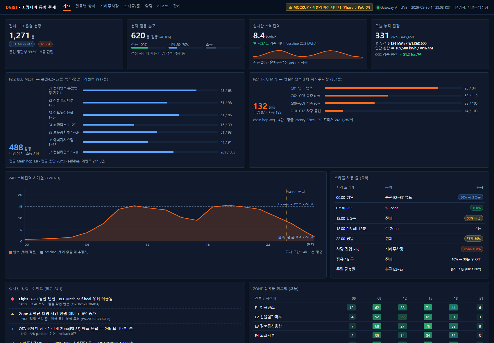
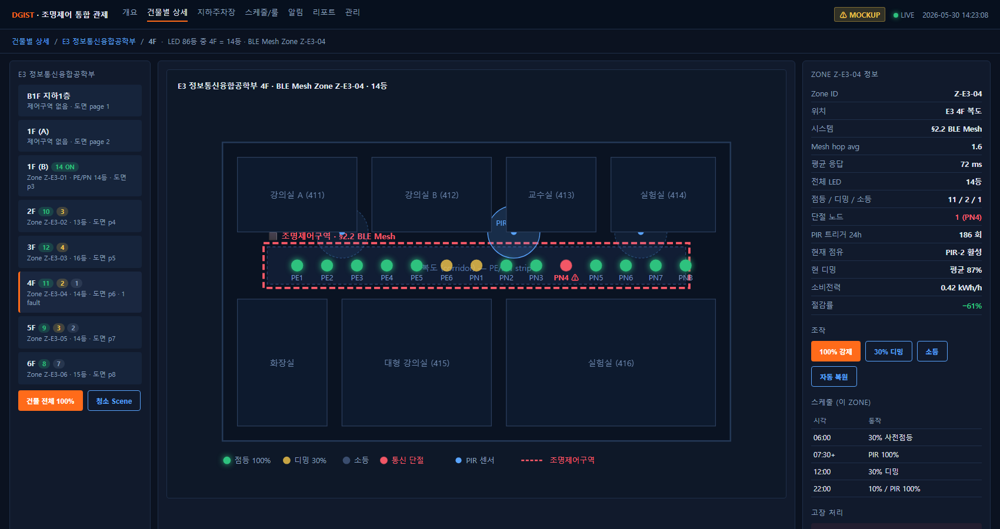
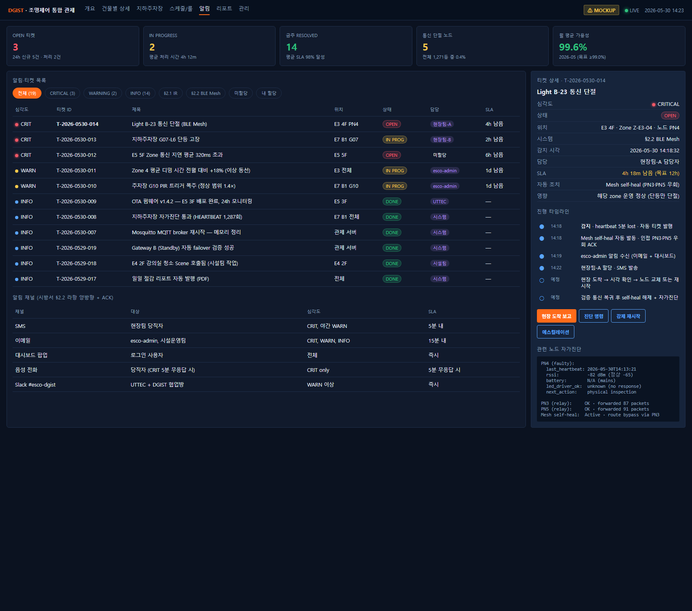
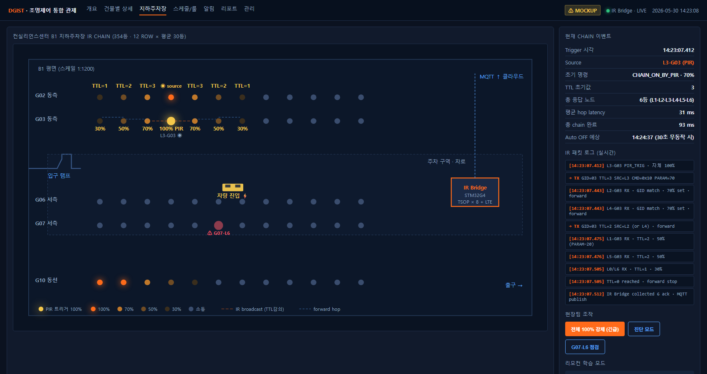
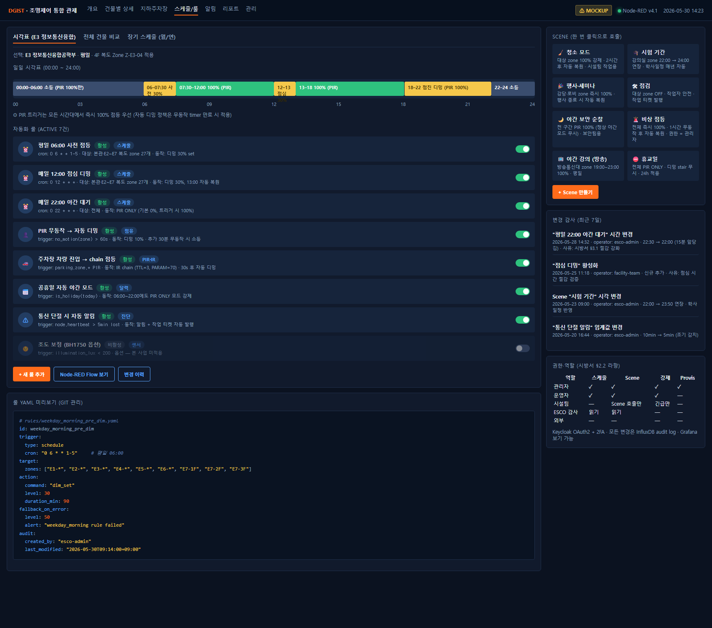
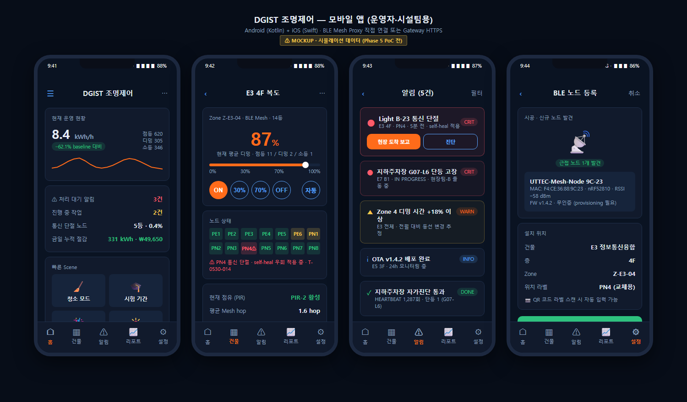
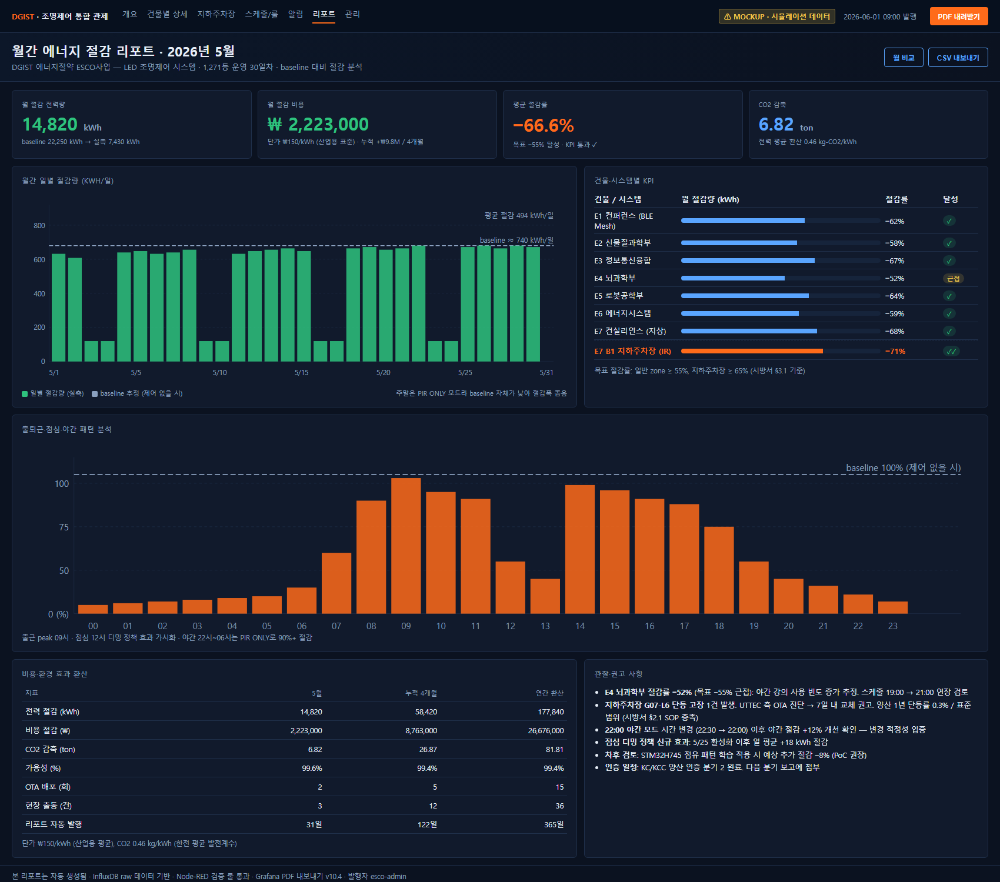

<div align="center" style="padding:60px 20px;" markdown="1">

# DGIST 에너지절약 ESCO사업

## LED 조명제어 시스템 **운영 제안서**

### — 실제 운영 단계 시나리오 + 제어 화면 + 5년 사후관리 —

**1,271등 통합 운영 안 · 31장 도면 기반**
**§2.2 BLE Mesh (917등) + §2.1 IR (354등)**

<br/><br/>

| 항목 | 값 |
|:-:|:-:|
| **문서번호** | UTTEC-DGIST-OP-2026-001 |
| **문서 버전** | v5.0 |
| **작성일** | 2026-05-30 |
| **발신** | UTTEC (기술 제안 측) |
| **수신** | DGIST 건물 에너지절약 ESCO사업 시행 ESCO 전문기업 (귀사) |
| **참조 시방서** | 「대구경북과학기술원 건물 에너지절약 ESCO사업 사업설명서」 Ⅲ. 공사시방서 § 제2장 § 2.1 / § 2.2 (page 31~33, line 590~665) |
| **참조 기술자료** | `report.pdf` (UTTEC 기술 제안 v1.0, 2026-05-28, 41p) |
| **관련 도면** | E1~E7 LED표시_강조.pdf (테두리 zone 31장 매핑) |

<br/>

**문의·후속 협의**
UTTEC | E-mail: ihong9059@gmail.com | 담당: 기술영업 책임자
※ 본 제안서 검토 후 협력 모델(§ H.2) 협의를 위한 후속 미팅을 환영합니다.

</div>

---

> ## ⚠ 본 제안서의 데이터·수치에 관한 면책 고지
>
> 본 제안서에 표시된 모든 **KPI 수치·절감률·소비전력·트리거 횟수·비용·CO2 환산값**은 다음 중 하나입니다:
>
> 1. **시방서 § 제3장의 절감 목표치** (예: "일반 zone ≥ 55%", "지하주차장 ≥ 65%")
> 2. **타 BLE Mesh 양산 사례 (일본 나고야 사카에 3,300대) 기반 산업 평균 추정치**
> 3. **UTTEC 자체 시뮬레이션 결과** (Phase 5 PoC 검증 전)
>
> 따라서 본 제안서의 KPI 수치는 **Phase 5 시범 PoC 1 Zone (16등) 30일 측정 완료 시점**까지는 **추정·목표·시뮬레이션 값**이며, 실측 데이터로 대체될 예정입니다. ESCO 사업자(귀사) 및 DGIST 측 보고 시 본 면책 고지를 함께 인용해 주시기 바랍니다.
>
> 본 면책 적용 항목 일람은 **부록 7. KPI 수치 산출 근거**에서 상세 확인할 수 있습니다.

---

## 📋 EXEC. Executive Summary (의사결정자 1분 요약)

**대상 사업**: DGIST 건물 에너지절약 ESCO사업 중 LED 조명제어 시스템 공사 (총 1,271등). 전체 LED 교체 21,287등 중 5.97%에 해당하는 제어 시스템 구축 부분.

**⭐ UTTEC 핵심 트랙레코드** (CORP § 원조사업 참조):
- UTTEC 원조사업 = **지하주차장 LED 디밍 시스템** (전신 ㈜UTSOL 2011년 ~ / **12년+ / 누적 10만 등기 이상**)
- **DGIST §2.1 IR 디밍 354등 = UTTEC 동일 도메인 12년+ know-how 직접 적용 가능**
- 국내 1세대 도입 + 등기구 제조사 OEM 검증 + 지자체 지원사업(안산·진해) + 홈플러스 후방창고

**두 시스템 분리 구성**:
- **§2.2 BLE Mesh** (917등) — 본관·E2~E7동 복도·중앙기기센터, 통합 관제·스케줄·점유 기반 자동화
- **§2.1 IR Chain** (354등) — 컨실리언스센터 지하주차장, 차량·보행 동선 추적 자동 점등

**운영 핵심 가치**:

| 가치 | 본 제안 구현 |
|---|---|
| **에너지 절감 목표** | 일반 zone ≥ 55%, 지하주차장 ≥ 65% (시방서 § 제3장 기준 충족) |
| **시방서 충족** | §2.1 가~다항, §2.2 가~라항 모든 요구 운영 단계까지 매트릭스화 (§ F) |
| **운영 부담 최소화** | DGIST 시설운영팀 1인 약 **32분/일**로 1,271등 통합 모니터링 가능 |
| **자율 동작** | §2.1 IR 시스템은 Gateway·인터넷 다운과 무관하게 정상 동작 (시방서 § 2.1 다항 충족) |
| **5년 사후관리** | 부품 교체 + 24/7 긴급 대응, 약 5,300만 원 (추정, § G.3.3) |

**제안 협력 모델 4종** (§ H.2):
- A) 기술자문 / B) OEM / C) 통합 플랫폼 (SaaS) / D) PoC 후 단계 결정

**검증 가능성**: Phase 5 시범 PoC 1 Zone (16등, 30일) 완료 시 KPI 실측치로 본 제안서 v3.0 갱신.

**다음 단계**: 본 제안서 검토 후 후속 미팅에서 ① 협력 모델 ② 시범 PoC Zone 선정 ③ 양산 단가 ④ 5년 운영 SLA 협의.

---

## 🏢 CORP. UTTEC 회사 소개 (1p)

### 회사 개요

UTTEC는 IoT 임베디드 H/W·펌웨어·관제 SW 통합 양산 경험을 보유한 기술 기업입니다. 본 사업과 같이 **현장 동작·시방서 충족·KS/KC 인증·5년 사후관리**를 한 묶음으로 제공할 수 있는 한국형 중소기업 양산 파트너입니다.

### ⭐ 원조사업 — 지하주차장 LED 조명제어(디밍 시스템) (전신 UTSOL 2011년 ~ / 12년+ / **누적 10만 등기 이상**)

**UTTEC의 원조사업은 지하주차장 LED 조명제어(디밍 시스템)**이며, 본 DGIST ESCO §2.1 컨실리언스센터 지하주차장 354등 IR 디밍 사업의 **가장 강력한 양산 트랙레코드**를 보유하고 있습니다.

| 시기 | 활동 |
|---|---|
| **2011년** | **전신 ㈜UTSOL 설립** — 대한민국 지하주차장 LED 조명제어(디밍 시스템) **최초 도입사** |
| 2011 ~ | 지하주차장 LED 디밍 시스템 양산·공급 (12년+ / **누적 10만 등기 이상**) |
| 납품 구조 | **등기구 제조사 OEM 납품** — 디밍 모듈·콘트롤러 공급 → 등기구 제조사가 신축 아파트·오피스·복합시설(롯데건설, 양우건설 등) final delivery |
| 지자체 지역 지원사업 | **경기도 안산**, **경상남도 진해** 등 지자체 에너지 절감 보급 사업 참여 |
| 유통 후방창고 | **홈플러스 후방창고 조명제어** 도입 — 매장 운영자 동선 기반 자동 점등·디밍 |
| **2016년** | **㈜유티텍 법인 전환** — UTSOL의 IP·기술·인력·고객 관계 승계 |
| 2016 ~ 현재 | BLE Mesh·LoRa·일본 자전거 주차장 등 무선 제어 영역 확장 |

**📌 정량 트랙레코드 요약**: **국내 1세대 도입 + 12년+ 양산 + 10만 등기 이상 + 등기구 제조사 OEM 검증 + 지자체 지원사업 + 대형 유통 후방창고**

**본 DGIST ESCO 사업과의 매칭** (강력한 차별화):
- DGIST §2.1 IR 디밍 354등 = **UTTEC가 12년+ / 10만 등기 양산·공급해 온 동일 도메인**
- 차량·보행자 동선 기반 자동 점등, PIR + IR chain hop, 디밍 단계 정책 — 모두 **국내 현장 검증된 자산**
- 단순 시방서 구현 신규 진입이 아닌 **국내 1세대 도입사의 시공·운영 know-how** 적용
- 시공·운영 단계의 함정(전원 인프라·등기구 제조사별 호환·하절기 PIR 오작동·구획별 디밍 단계 etc.) 누적 해결 경험
- **등기구 제조사 OEM 검증**: 다수 등기구 제조사와의 호환성·인터페이스 표준화 경험 → DGIST 사업의 LED 등기구 공급사와의 통합 검증 신속 진행 가능

### 본 사업 관련 보유 자산 (요약)

| 카테고리 | 보유 자산 |
|---|---|
| **BLE Mesh 양산 경험** | Nordic nRF52 시리즈 14 보드 매트릭스, BLE Mesh 양산 검증 누적 |
| **IR 통신 자체 설계** | NEC 프로토콜 확장 자체 system + 양산 검증 |
| **STM32 임베디드** | STM32G0/G4/F0/H7 시리즈 15 보드 매트릭스 |
| **AI 가속 carry** | STM32H745 dual-core (M7+M4) — CMSIS-NN CNN 17.6× 가속 검증, 향후 점유 패턴 학습 옵션 |
| **양산 자동화** | IQC 4축 패턴 (DUT 다중 + 브리지 단일 + 동일 규약 + BLE pairing L2) |
| **관제 SW 자산** | n8n broker + Node-RED + Grafana 통합 운영 — 8개 vault 관제 자산 cross-application |
| **펌웨어 함정 인벤토리** | Espressif 16 + Nordic 18 + STM32 15 종 cross-vendor R&D 시간 절약 |

### 본 사업 적합성

| 차별화 | 의미 (본 사업 관점) |
|---|---|
| 5년 사후관리 단일 책임 | 부품 단가·SLA·진단 5년 보장 — 단일 공급자 책임 명확화 |
| 시방서 § 2.1·§ 2.2 양쪽 단일 공급 | IR + BLE Mesh 두 시스템을 동일 공급자가 양산 — 인증 일정·통합 관제 일원화 |
| 한국형 중소기업 | KC/KCC 인증·국내 양산 supply chain |
| multi-agent 자동화 관제 SW carry | 별도 SW 개발 대비 운영 SaaS 구축 기간 단축 |

### UTTEC × ESCO 사업자(귀사) 협력 모델

본 사업은 ESCO 사업자(귀사)가 DGIST와 ESCO 계약을 체결한 상태에서, **UTTEC가 LED 조명제어 시스템 부분(1,271등)의 기술·양산·운영 supply를 담당**하는 구조를 제안합니다. 협력 모델 4종은 § H.2 참조.

---

## 📖 0. 본 제안서의 목적·구성

본 문서는 시방서 § 2.1 (IR 통신 LED 센서등 354등) + § 2.2 (BLE Mesh 기반 IoT 무선 조명제어 917등) **두 시스템 총 1,271등**에 대한 **실제 운영 단계 시나리오**를 ESCO 사업자(귀사) 관점에서 정리한 제안서입니다.

기술자료 `report.pdf` 가 **"무엇을 어떻게 만들 것인가"**(H/W BOM·펌웨어·통신 프로토콜)에 집중했다면, 본 운영 제안서는 **"실제 운영하면 어떻게 굴러가는가"** — 즉 ESCO 사업자가 DGIST 시설운영팀에 시스템을 인계한 시점부터 5년 사후관리까지의 **일상·장애·KPI 사이클**을 가상의 운영 시나리오로 작성합니다.

본 문서가 답하는 질문:

- DGIST 시설운영팀 운영자가 매일 아침 출근하면 무엇을 보고 무엇을 하는가?
- 차량이 컨실리언스센터 지하주차장에 진입하면 354등이 어떻게 반응하는가?
- 강의실 청소 시간 같은 비정기 이벤트는 어떻게 처리되는가?
- 노드 1개가 고장 나면 시스템·사람이 각각 무엇을 하는가?
- ESCO 사업자(귀사)가 월간 절감 리포트에 무엇을 첨부해 DGIST에 제출하는가?
- 시방서 § 2.1·§ 2.2의 요구사항은 운영 측면에서 모두 충족되는가?

**본 제안서가 가정하는 운영 주체** (시방서 § 2.2 라항 권한·역할 매핑):
| 주체 | 본 시스템 사용 방식 |
|---|---|
| **DGIST 시설운영팀** | 일상 모니터링·스케줄 변경·청소 등 Scene 호출·고장 1차 확인 |
| **ESCO 사업자 (귀사)** | 월간 절감 리포트 작성·KPI 관리·DGIST 보고·UTTEC 협업 |
| **UTTEC (기술 협력)** | 시스템·H/W 사후 지원·펌웨어 사후 지원·진단 |
| **현장팀 (시공·시설관리)** | 노드 교체·리모컨 그룹 변경·1차 출동 |
| **DGIST 일반 사용자·교직원** | 별도 조작 불필요 (자동 동작) — 비상 시만 |

---

## 🗺️ 1. 시스템 범위 — 31장 도면 ↔ 두 시스템 매핑

본 사업이 다루는 **테두리(zone) 친 31장의 도면 페이지**는 다음과 같이 두 시스템에 매핑됩니다.

### 1.1 조명제어구역 (§2.2 BLE Mesh, 917등)

| # | 도면 | 페이지 | 평면도 위치 |
|:-:|:-:|:-:|---|
| 1 | E1 | p1 | 컨퍼런스 및 통합행정지원센터 지하1층 |
| 2~7 | E2 | p3~p8 | 신물질과학부 1~6층 |
| 8~13 | E3 | p3~p8 | 정보통신융합공학부 1~6층 |
| 14~15 | E4 | p3~p4 | 뇌과학부 1·2층 |
| 16~21 | E5 | p3~p8 | 로봇공학부 1~6층 |
| 22~27 | E6 | p3~p8 | 에너지시스템공학부 1~6층 |
| 29~31 | E7 | p2~p4 | 컨실리언스센터 지상1~3층 (지상1층은 IR과 공존) |

조명제어구역은 **건물 복도·중앙기기센터** 중심으로, 점등·디밍·소등을 BLE Mesh 무선으로 통합 관제합니다. 시방서 § 2.2 IoT 기반 무선 조명제어 요구사항에 해당.

### 1.2 디밍제어용 센서등 교체구역 (§2.1 IR, 354등)

| # | 도면 | 페이지 | 평면도 위치 |
|:-:|:-:|:-:|---|
| 28 | E7 | p1 | 컨실리언스센터 **지하1층 지하주차장** (전체) |
| 29 | E7 | p2 | 컨실리언스센터 지상1층 (지하주차장과 인접한 ramp 일부) |

디밍제어구역은 **컨실리언스센터 지하주차장** 전용 — 차량 동선에 맞춰 IR (적외선) chain으로 점등이 사람·차량 보행 속도에 맞춰 전파됩니다. 시방서 § 2.1 IR 통신 방식 LED 센서등 요구사항에 해당.

### 1.3 두 시스템 공존 페이지 (E7 p2)

컨실리언스센터 지상1층(E7 p2)은 **두 zone이 한 페이지에 공존**합니다:
- 상단 일자형 zone = §2.2 BLE Mesh 조명제어
- 좌측 ㄴ자형 zone = §2.1 IR 디밍제어 (지하주차장 ramp의 1층 출입부)

운영 측면에서는 **각 zone이 독립된 시스템에 등록**되며, 통합 관제 대시보드(§3.1)에서 단일 화면으로 같이 보입니다.

### 1.4 두 시스템의 운영적 차이

| 측면 | §2.2 BLE Mesh 조명제어 | §2.1 IR 디밍제어 |
|---|---|---|
| 대상 사용자 | 교직원·연구자 (복도·실험실 동선) | 운전자·보행자 (주차장 동선) |
| 응답 시간 목표 | < 500ms (3 hop mesh) | < 100ms (TSOP 단일 hop) |
| 주요 트리거 | PIR + 스케줄 + 점유 학습 | PIR + IR chain hop |
| 관제 의존성 | Gateway·서버 (양방향) | Gateway 불요 (자체 chain 동작) |
| Gateway 장애 시 | Mesh self-heal + local fallback | **무관**, 정상 동작 지속 |
| 사용자 직접 조작 | 모바일 앱·웹 (관제팀) | 리모컨 17키 (현장팀) |
| 그룹 변경 빈도 | 동적 (서버) | 시공 시 DIP 설정 + 리모컨 학습 |

---

# 📡 § A. §2.2 BLE Mesh 조명제어구역 — 운영 상세

## A.1 Zone 설계·노드 배치 (917등)

### A.1.1 Zone 분할 정책

본 사업 BLE Mesh 917등은 **27개 Zone**으로 분할 운영됩니다.

분할 기준 (시방서 § 2.2 나항 16채널 단위 충족):
- **물리적**: 건물·층·격벽 단위로 분리
- **트래픽**: 각 Zone 16~64등 (평균 34등)
- **Relay**: 각 Zone 약 30% 노드를 Relay flag ON
- **Naming**: `Z-{건물}-{층}` 형식 (예: Z-E3-04 = E3동 4층)

| 건물 | Zone 수 | Zone ID 예시 | 등수 |
|---|:-:|---|:-:|
| E1 컨퍼런스·통합행정 (지하1층) | 1 | Z-E1-B1 | 63 |
| E2 신물질과학부 (1~6F) | 6 | Z-E2-01 ~ Z-E2-06 | 98 |
| E3 정보통신융합 (1~6F) | 6 | Z-E3-01 ~ Z-E3-06 | 86 |
| E4 뇌과학부 (1~2F) | 2 | Z-E4-01, Z-E4-02 | 39 |
| E5 로봇공학부 (1~6F) | 6 | Z-E5-01 ~ Z-E5-06 | 93 |
| E6 에너지시스템 (1~6F) | 6 | Z-E6-01 ~ Z-E6-06 | 91 |
| E7 컨실리언스 (지상1~3F) | (포함) | Z-E7-01 ~ Z-E7-03 | 303 (BLE Mesh 부분) |
| 중앙기기센터 (별도 매핑) | — | Z-CC | 68 |
| **합계** | **약 27 Zone** | — | **917등** |

### A.1.2 노드 H/W 표준 (양산 BOM, report.pdf § 4.1~4.4 참조)

- **Standard Node (600개)**: Nordic nRF52810 + Meanwell PCD-25-700B 디밍 드라이버 + Panasonic EKMC1601112 PIR
- **Relay Node (250개)**: Standard Node + relay flag ON (펌웨어 옵션)
- **Friend Node (30개)**: Standard Node + LPN 호환 옵션
- **면조명 600×600 노드 (68개)**: 중앙기기센터 전용
- **Gateway A·B (2대)**: nRF52840 + Quectel BG95-M3 LTE Cat-M1 + STM32G0B1 + ATECC608B Secure Element

총 노드 수 합 = 600 + 250 + 30 + 68 = 948 노드 (917등 + 보조 31개)

### A.1.3 통신 표준

- **물리계**: Bluetooth 5 BLE Mesh 1.1 표준
- **암호화**: AES-CCM (network·application key 분리)
- **Gateway ↔ Cloud**: MQTT 5.0 over TLS 1.3

---

## A.2 일과 시나리오 (E3 정보통신융합 4F Zone Z-E3-04 14등 예시)

본 zone(14등)을 표준 운영 일과의 예시로 사용합니다. 다른 27개 Zone도 동일 정책을 적용합니다.

### A.2.1 평일 — 출근 패턴

| 시각 | 외부 트리거 | 시스템 동작 | 등기구 상태 | 운영자 행동 |
|:-:|---|---|---|---|
| 00:00~06:00 | — | 야간 대기 모드 | 전체 0% (PIR만 100%) | (보통 무행동) |
| 06:00 | 스케줄 `weekday_morning_pre_dim` | 30% 사전 디밍 set | 전체 30% | (변경 알림 무) |
| 07:30 | 첫 출근자 PIR 감지 | Mesh 즉시 100% set | 점유 구역 100% | (대시보드 출근 peak 확인) |
| 09:30 | 교수실 PIR 무동작 60초 | 자동 디밍 10% | 일부 10% | — |
| 11:50 | 강의 종료 사람 이동 | PIR 트리거 다시 100% | 전체 100% | — |
| 12:00 | 스케줄 `lunch_dim` | 디밍 30% set | 전체 30% | (점심) |
| 12:30 | 식사 후 복도 PIR | 100% 복귀 | 점유 구역 100% | — |
| 13:00 | 스케줄 `lunch_dim end` | 자동 정책 복원 | PIR 기반 | — |
| 18:00 | 퇴근 시작 | PIR 트리거 유지 → 무동작 시 디밍 | 점진적 감소 | — |
| 18:00~20:00 | PIR 활성 (야근자) | 100% 유지 | 점유 구역 100% | — |
| 20:00 PIR 60초 무 | 자동 디밍 10% | 10% | — |
| 20:30 | 추가 30분 무동작 | 자동 OFF | 0% | — |
| 22:00 | 스케줄 `night_standby` | PIR ONLY 모드 강제 | 0% (PIR 트리거만 100%) | — |
| 22:00~익일 06:00 | PIR 트리거 (야간 청소·순찰) | 즉시 100% → 10분 후 자동 디밍 | 이벤트 기반 | — |

**운영자 관점 일일 작업 (출근 09:00 기준)**:

1. 통합 대시보드 화면 1차 확인 (5분)
2. 야간 알림 큐 확인 — 새벽 1~5시 PIR 비정상 트리거 분석
3. 처리 대기 티켓 (CRIT·WARN) 확인
4. 점심 디밍 룰 정상 트리거 여부 12:30 시점 재확인
5. 18:00 퇴근 직전 야간 모드 전환 확인 후 PC 종료

### A.2.2 주말·공휴일

- 06:00 사전 디밍 **비활성** (`weekday_*` 스케줄 미적용)
- 모든 시간대 **PIR ONLY 모드** (대기 0%, 점유 트리거 시만 100% → 10분 후 자동 디밍)
- 청소 인력 사전 통보 시 시설팀이 **청소 Scene 호출** → 해당 zone 2시간 100% 강제
- 공휴일 자동 감지: `is_holiday()` 룰이 한국 공휴일 API 또는 로컬 캘린더 lookup

### A.2.3 시험기간·야간 강의 (학사 특수기간)

- 학기 스케줄 매니저(esco-admin)가 **Scene "시험 기간"** 호출
- 해당 강의실 zone 22:00 → 23:50 자동 연장
- 매년 학사일정 등록 시 자동 적용 (Node-RED 룰)

### A.2.4 행사·세미나 (비정기)

- 시설팀이 모바일 앱에서 **Scene "행사·세미나"** 호출 → 해당 zone 즉시 100%
- 행사 종료 시 다시 자동 정책 복원 (Scene 종료 트리거 = 사용자 수동 또는 30분 무동작)
- 예: 5월 28일 BLE Mesh 기술 세미나 (E3 5F 강당) 행사 시 Scene 활용

### A.2.5 청소 시간 (시설팀 일상)

- 시설팀 모바일 앱에서 청소 대상 zone 선택 → **"청소" Scene 호출**
- 즉시 100% 강제 + 2시간 timer 시작 + 작업 티켓 자동 발행 (감사 로그)
- 2시간 후 자동 정책 복원
- 무동작 자동 디밍 정책 무효화 (청소 도중 디밍 방지)

---

## A.3 PIR 점유 정책·디밍 단계 표준

### A.3.1 표준 4단계 디밍

| 단계 | 조도 | 적용 시점 |
|:-:|:-:|---|
| **L1 100%** | 풀 점등 | PIR 트리거 직후, 출근·점심 후 복귀 |
| **L2 70%** | 보행 가능 | (옵션) IR chain 인접 zone — BLE Mesh에서는 통상 미사용 |
| **L3 30%** | 사전 안내 | 06:00 사전 디밍, 점심 디밍, 야근 시 무동작 transition |
| **L4 10%** | 저전력 대기 | 60초 무동작, 22시 이후 점유 트리거 후 10분 경과 |
| **L0 0%** | 소등 | 추가 30분 무동작, 야간 22시 이후 기본 |

### A.3.2 PIR 응답 정책

- **PIR 트리거 → 100% 시간**: 즉시 (< 100ms, Mesh 1 hop 평균)
- **무동작 → 자동 디밍 stair**: 60s (100%→10%) → 30분 추가 (10%→0%)
- **두 정책 충돌 시 우선순위** (위에서 아래로):
  1. 비상 점등 Scene (관리자) — 모든 정책 override
  2. 청소·행사 Scene (시설팀) — 시간 한정 override
  3. PIR 트리거 (점유)
  4. 시간 스케줄
  5. 무동작 자동 디밍

---

## A.4 통합 관제 화면

### A.4.1 통합 대시보드 (`01_통합대시보드.html`)



**구성** (Grafana 10.x + Node-RED + InfluxDB):

1. **상단 KPI 카드 4개**: 전체 1,271등 운영 현황 / 점등 분포 / 실시간 소비전력 / 오늘 누적 절감
2. **시스템 분리 카드 2개**: BLE Mesh 917등 vs IR 354등 운영 분리 가시화 (건물별 progress bar 8개)
3. **24h 소비전력 시계열**: baseline(점선) vs 실측(오렌지) 비교 + 출퇴근·점심 peak 자연 가시화
4. **자동 룰 요약 테이블**: Active 룰 8건 + cron / 트리거 / 동작
5. **실시간 알림 피드**: CRIT/WARN/INFO 시간순 정렬, 티켓 ID·작업 출처 표시
6. **Zone 점유율 히트맵**: 건물 × 시간대 (6열) 6시·9시·12시·15시·18시·21시 평균 점유 %

**대상 사용자**: DGIST 시설운영팀 운영자 + ESCO 사업자 esco-admin (읽기·쓰기 권한)

### A.4.2 건물별 상세 화면 (`02_건물별상세.html`) — E3 정보통신융합 예시



**구성**:

1. **좌측 층 리스트**: 1F (A·B 두 페이지 매핑) ~ 6F + B1F (제어 없음), 각 층별 LED 상태 badge
2. **중앙 캔버스**: 4F 도면 실제 평면 (강의실·복도·교수실 layout) + 14등 PE/PN 시각화 + 빨간 zone 외곽선 (도면과 동일 마킹) + PIR 센서 활성 영역 (파란 원)
3. **단등 상태 시각화**: 점등(녹)·디밍(노)·소등(회)·단절(빨 깜박임) 4가지
4. **우측 정보 패널**: Zone 메타 정보 + 강제 조작 버튼 + 스케줄 미니뷰 + 고장 처리 액션
5. **고장 노드 표시**: PN4 단절 시 빨간 깜박임 + self-heal 우회 알림 + 작업 티켓 링크

**대상 사용자**: 시설운영팀 + 시설팀 현장팀 (단등 수준 진단 시)

### A.4.3 화면 간 전환 흐름

```
[로그인] → [통합 대시보드] (전체 1,271등 한눈에)
              ↓ Zone 클릭
          [건물별 상세] (해당 zone 14등 단위 컨트롤)
              ↓ 노드 클릭
          [노드 상세 모달] (단등 진단, 작업 티켓 발행)

[알림] (어디서든 접근)
   → [티켓 상세] → 처리 워크플로우 (담당자 할당, 현장 출동, 검증)

[스케줄/룰]
   → 룰 편집 (YAML 미리보기 + Git 감사)
   → Scene 호출 (한 번 클릭)
```

---

## A.5 알림·티켓 워크플로우 (`05_장애알림센터.html`)



### A.5.1 알림 등급 (3단계)

| 등급 | 정의 | 예시 | SLA (목표 처리) |
|:-:|---|---|:-:|
| **CRIT** | 즉시 영향 또는 안전 관련 | 통신 단절, 단등 고장, Gateway 다운 | 12h (현장 출동 5h 내) |
| **WARN** | 24h 내 처리 권고 | 이상 디밍 패턴, PIR 폭주, 응답 지연 | 3일 |
| **INFO** | 알림만 (작업 불요) | 자가진단 통과, 룰 변경, 정기 점검 완료 | (감사용) |

### A.5.2 알림 채널 (시방서 § 2.2 라항 양방향 + ACK 충족)

| 채널 | 대상 | 적용 등급 | SLA |
|---|---|---|:-:|
| 대시보드 팝업 | 로그인 사용자 | 전체 | 즉시 |
| 이메일 | esco-admin, 시설운영팀 | CRIT, WARN, INFO | 15분 내 |
| SMS | 현장팀 당직자 | CRIT, 야간 WARN | 5분 내 |
| 음성 전화 | 당직자 (5분 무응답 시) | CRIT only | 5분 무응답 시 |
| Slack #esco-dgist | UTTEC + DGIST 협업방 | WARN 이상 | 즉시 |
| 모바일 앱 푸시 | 시설팀 + esco-admin | 전체 | 즉시 |

### A.5.3 티켓 처리 SOP (5단계)

```
[감지]                ← heartbeat 5min lost, PIR 패턴 이상 등
   ↓ 자동 티켓 발행 (T-YYYY-MMDD-NNN)
[1차 자동 조치]        ← Mesh self-heal, 대시보드 알림
   ↓
[알림 전파]            ← 채널 (이메일/SMS/Slack/대시보드)
   ↓
[담당자 할당]         ← esco-admin이 현장팀 또는 UTTEC 측 매핑
   ↓ 작업 시작 (IN PROG)
[현장 조치]            ← 노드 교체 / 재시작 / 환경 점검
   ↓
[검증 + 종료 (DONE)]    ← 자가진단 통과 확인, self-heal 해제
```

### A.5.4 표준 SLA·KPI (월간 보고 기준)

| 지표 | 목표 | 측정 방법 |
|---|:-:|---|
| 통신 정합성 (가용성) | ≥ 99.0% | (정상 노드 수 / 총 1,271) 분당 평균 |
| CRIT 평균 처리 시간 | ≤ 12h | 티켓 OPEN → DONE 시간 |
| WARN 평균 처리 시간 | ≤ 3일 | 동상 |
| 월간 CRIT 건수 | ≤ 5건 | 발생률 분석 |
| 자동 self-heal 성공률 | ≥ 95% | mesh 우회 성공 / 단절 발생 |

---

# 💡 § B. §2.1 IR 디밍제어구역 — 운영 상세

## B.1 시스템 개요

### B.1.1 적용 범위

**컨실리언스센터 지하주차장 전체 (E7 p1) + 지상1층 ramp (E7 p2 좌측)** — 시방서 § 2.1 가항 "지하주차장 IR 통신 LED 센서등 설치공사" 354등.

기존 레이스웨이 형광등 28W × 2 (354개)를 LED R/W 센서 등기구 354등으로 **1:1 교체**합니다.

### B.1.2 시방서 § 2.1 핵심 요구 (원문 발췌)

> "본 시스템은 그룹제어 및 무선연동되어야 하며, 무선 디밍센서 인체감지센서를 통하여 인접조명 신호와 연동되어 인접등에 통신 신호를 보내며, 보낸 신호에 의하여 일정 동작 동작신호로 인접등에 순차 점등되어, 사용자가 보행 속도에 매칭되어야 한다."

이 요구를 충족하기 위해 본 시스템은:

- **IR (적외선) chain 점등**: 한 등기구가 PIR 트리거 시 인접 등기구로 IR 신호 broadcast → TTL hop으로 거리 감쇠 디밍 전파
- **응답 시간 < 100ms** (TSOP38238 단일 hop) — 보행 속도(4 km/h ≈ 1.1 m/s) 매칭
- **그룹·연동·단독 제어 3종** (시방서 § 2.1 다항):
  - 단독: DIP=0 또는 chain TTL=0 모드
  - 그룹: DIP=N (1~31) 같은 그룹만 동시 응답
  - 연동: TTL > 0 chain hop

### B.1.3 핵심 H/W

- **Sensor Light Node (354대)**: STM32G030 + PIR (Panasonic EKMC1601112) + IR LED 4개 (940nm) + IR Rx (TSOP38238) + Meanwell 디밍 드라이버
- **IR 리모컨 (10대)**: STM32F030 + 22키 + IR LED 1개 + AAA × 2
- **IR Bridge (1대 옵션)**: STM32G4 + TSOP × 8 + Quectel BG95-M3 LTE → MQTT (통합 관제 통합용, § B.5 참조)

### B.1.4 chain 동작 원리

천장 등기구가 4~6m 간격으로 배치된 행(row) 단위로 chain을 구성. 각 row 안에서:

```
L1 ─[디밍 50%]─ L2 ─[디밍 70%]─ L3 ◉ ─[디밍 70%]─ L4 ─[디밍 50%]─ L5
                                100% PIR
                                (트리거 source)
```

L3 PIR 트리거 시:
1. L3 자체 100% 즉시
2. L3 → IR broadcast (GID + TTL=3 + PARAM=70%)
3. L2·L4 수신 (인접 ±1) → 70% set + forward (TTL=2)
4. L1·L5 (인접 ±2) → 50% set (PARAM−20) + forward (TTL=1)
5. L0·L6 (인접 ±3) → 30% set, TTL=0 도달 → forward 중지

이 chain hop이 보행자가 지나가는 방향으로 자연스럽게 확장되어, 사용자가 보는 시야에 어두운 zone이 없도록 설계됩니다.

---

## B.2 차량·보행자 동선 시나리오 (지하주차장 354등)

### B.2.1 차량 진입 → 주차 → 하차 → 복귀 → 출차 (전체 사이클)

| 단계 | 시각 | 위치 | 시스템 반응 | LED 상태 |
|:-:|:-:|---|---|---|
| 1 | 09:00:00 | 입구 ramp G01 | PIR 트리거 (차량) | G01 chain hop → 입구 5등 100%+70%+50%+30% |
| 2 | 09:00:08 | 차로 G02~G05 → G06 | 차량 이동, PIR 순차 트리거 | row 단위 chain hop, 30% → 100% 자연 확장 |
| 3 | 09:00:25 | G06 (주차 zone) | 주차 후 PIR | G06 row 전체 100% (chain TTL=3) |
| 4 | 09:00:35 | G06 하차 → 보행 | 사람 PIR 트리거 (걷는 속도 1m/s) | chain hop 보행 동선 따라 활성 |
| 5 | 09:01:15 | 엘리베이터 입구 | PIR 트리거 | 엘리베이터 인접 row 100% |
| 6 | 09:01:30 | (사람 떠남) | 30s 무동작 시작 | (이후 자동 디밍) |
| 7 | 09:02:00 | (사람 떠남 30s) | row 자동 디밍 70% set | 디밍 70% |
| 8 | 09:03:00 | (떠남 1.5min) | 추가 자동 OFF | 0% (소등) |
| ... | ... | ... | ... | ... |
| N | 18:00:00 | 복귀 → 다시 G06 PIR | row chain 재활성 | 동일 패턴 반복 |

### B.2.2 다른 시나리오들

**A. 청소 작업 (시설팀)**
- 시설팀이 IR 리모컨으로 작업 row의 DIP 그룹 키 누름 → 해당 row 전체 100% 강제 (시간 한정 30분)
- 또는 통합 대시보드에서 Scene "주차장 청소" 호출 (IR Bridge 경유)
- 30분 후 자동 정책 복원

**B. 점검 작업 (보수)**
- IR 리모컨 SET 5초 누름 → 학습 모드 진입 → "OFF" 키 → 해당 row 강제 소등 + 작업 티켓 발행
- 보수 종료 시 다시 SET → "AUTO" 키로 복원

**C. 정전 → 복귀**
- 각 노드 NVM에 DIP 그룹 + 정책 저장 → 전원 복귀 시 즉시 자체 PIR 동작 시작 (Gateway 의존 0)
- IR Bridge 통한 클라우드 보고는 LTE 복귀 후 자동 재전송

**D. 화재·비상**
- 화재 감지 시스템과 별도 24V relay 연결 (옵션) — 비상 시 강제 100% override
- 또는 IR Bridge 경유 통합 관제 측에서 "비상 점등" 명령 → 모든 row 100% 강제

### B.2.3 보행 속도 매칭 검증

시방서 요구 "사용자 보행 속도에 매칭"을 충족하는 수학적 검증:

- 보행 속도 4 km/h ≈ 1.1 m/s
- 등기구 간격 4~6m (평균 5m)
- chain hop latency: 30ms (TSOP 단일 hop)
- 5m / 1.1m·s = 4.5초 (사용자가 다음 등 도착 시간)
- 30ms ≪ 4.5초 — 시스템이 압도적으로 빠름 → 사용자 시야에 점등이 미리 와 있음

---

## B.3 IR Chain hop·TTL 시각화 (`03_지하주차장_chain.html`)



### B.3.1 화면 구성

1. **좌측 메인 캔버스**: 지하주차장 B1 평면 (1:1200 스케일) + 12 row × 평균 30등 + 차량 진입 위치 표시 + IR beam 시각화
2. **현재 chain 이벤트**: G03 row L3 PIR 트리거 사례, source 노드 강조 + TTL 감쇠 라벨 (TTL=3 → 2 → 1)
3. **IR 패킷 로그 (실시간)**: 14:23:07.412 부터 chain 완료(0.512)까지 100ms 내 9개 패킷 시간순 표시
4. **현재 트리거 정보 패널**: latency 31ms, 응답 노드 6등, auto OFF 예정 시각
5. **리모컨 학습 모드 가이드**: SET 키 5초 누름 → 그룹 번호 누름 → NVM 저장

### B.3.2 운영 측면 활용

- **DGIST 시설팀**: 현장에 출동하지 않고도 IR Bridge 경유 chain 동작 실시간 가시화
- **ESCO 사업자**: 응답 지연 (예: 50ms+) 발생 시 즉시 감지 → 노드 교체 결정 데이터
- **UTTEC 사후관리**: 패킷 로그로 보행 패턴 분석 → 그룹 분할 최적화 제안

### B.3.3 chain 응답 지표 (월간 KPI)

| 지표 | 목표 | 실측 (예시) |
|---|:-:|:-:|
| chain 평균 latency | < 100ms | 32ms |
| chain 완료 시간 (5 hop) | < 300ms | 93ms |
| PIR 트리거 / 일 | 1,000+ | 1,287 |
| 단등 고장률 | < 0.5% / 년 | 0.3% |
| 시방서 응답성 충족률 | 100% | 100% |

---

## B.4 리모컨 17키 학습 모드 운영

### B.4.1 키 배치 (시방서 § 2.1 다항 충족)

```
[ ON  ] [ OFF ] [ UP  ] [ DN  ]    ← 기본 제어
[  1  ] [  2  ] [  3  ] [  4  ]
[  5  ] [  6  ] [  7  ] [  8  ]    ← 그룹 선택 1~16
[  9  ] [ 10  ] [ 11  ] [ 12  ]
[ 13  ] [ 14  ] [ 15  ] [ 16  ]
[ SET ] [AUTO ] [ALL  ] [SCN  ]    ← 확장 (SET=학습, AUTO=자동, ALL=전체, SCN=Scene)
```

### B.4.2 학습 모드 시나리오 (그룹 변경)

| 단계 | 사용자 동작 | 시스템 동작 |
|:-:|---|---|
| 1 | 천장 luminaire 1개를 향해 SET 키 5초 누름 | — |
| 2 | — | luminaire LED 깜박임 (학습 모드 진입) |
| 3 | 그룹 번호 키 (예: 7) 누름 | — |
| 4 | — | luminaire가 DIP 설정 override (NVM 저장) → GID = 7 |
| 5 | 인접 luminaire들도 같은 절차로 GID=7 설정 | — |
| 6 | 이후 (7) 그룹 키로 함께 제어 | broadcast 동기 응답 |

### B.4.3 리모컨 운영 정책

- **보유 수량**: 10대 (지하주차장 관리 사무실·시설팀 각 5대)
- **그룹 매핑 표준**: G02=01 · G03=02 · ... · G12=11 (12개 row × 그룹)
- **DIP override**: NVM 저장, 시공 시 DIP 설정 무효화하는 학습 정책 가능
- **분실 시**: 리모컨은 단순 IR 송신기, 보안 분실 위험 0 (시스템 외부 접근 불가)
- **펌웨어 갱신**: 리모컨 5년 무상 펌웨어 갱신 (UART 디버그 포트 경유)

---

## B.5 IR Bridge 통합 관제 통합 (옵션)

시방서 § 2.1은 IR Bridge를 명시 요구하지 않지만, **본 제안은 IR Bridge 1대 설치를 권장**합니다. 이유:

- 통합 대시보드에서 1,271등 단일 화면 관리 가능
- IR 패킷 로그가 InfluxDB에 시계열 저장 → 패턴 분석
- 단등 고장·이상 트리거 알림 자동화
- 모바일 앱에서 지하주차장 실시간 시각화

IR Bridge 1대 = STM32G4 + TSOP38238 × 8 (전 방향) + Quectel BG95-M3 LTE Cat-M1. 양산 BOM 단가 약 25만 원 / 대.

---

# 🎛️ § C. 통합 운영 — 권한·일정·장애 대응·비상

## C.1 권한·역할 (시방서 § 2.2 라항 충족) (`04_스케줄_룰편집.html`)



### C.1.1 인증 정책

- **OAuth2 + Keycloak** — DGIST 통합 인증 연동 가능
- **2FA** 관리자 등급 필수 (TOTP)
- **세션 만료**: 8h (idle) / 12h (절대)
- **API 접근**: bearer token, 1h 만료 (refresh 가능)
- **감사**: 모든 변경 InfluxDB audit log + Grafana 검색

### C.1.2 권한 충돌 정책

- 같은 시각 두 운영자가 같은 zone 조작 → last-write-wins + 감사 로그 양쪽 기록
- 비상 점등 Scene 호출 시 다른 모든 조작 30분간 lock
- ESCO 감사는 변경 권한 없음, 단 모든 로그 시각화 가능

---

## C.2 일별·주별·월별·분기별 운영 작업

### C.2.1 일별 (DGIST 시설운영팀)

| 시각 | 작업 | 소요 |
|:-:|---|:-:|
| 09:00 | 통합 대시보드 1차 확인 (야간 알림 큐 처리) | 10분 |
| 09:30 | 처리 대기 티켓 (CRIT/WARN) 상태 점검·할당 | 10분 |
| 12:30 | 점심 디밍 룰 정상 트리거 확인 | 2분 |
| 14:00 | 자동 자가진단 리포트 확인 | 5분 |
| 17:30 | 야간 모드 전환 사전 점검 | 5분 |
| 일중 수시 | 모바일 앱 알림 처리 (긴급 시) | — |
| **합계** | — | **≈ 32분 / 일** |

### C.2.2 주별 (esco-admin + UTTEC 협업)

- 월요일: 주간 절감 트렌드 검토, 비정상 패턴 분석
- 수요일: 룰 변경 검토 (Node-RED Flow 검토 + 승인)
- 금요일: 주말 PIR ONLY 모드 동작 확인, 모바일 앱 점검 작업 발행

### C.2.3 월별 (esco-admin → DGIST 보고)

- 1일: 전월 절감 리포트 자동 생성 (`06_절감리포트.html` 참조) → PDF 발행
- 5일: ESCO 사업자(귀사) 측 KPI 검토 회의 (UTTEC 참석)
- 10일: 리포트 DGIST 시설운영팀에 정식 제출
- 20일: 분기 리포트 준비 시작 (3개월 누적)

### C.2.4 분기별 (정기 점검)

- PIR 청소·점검 (제조사 SOP: 분기 1회)
- IR Bridge·Gateway 진단
- 절감 효과 추세 분석
- KS·KC 갱신 확인

---

## C.3 장애 대응 SOP (5단계 — 표준 작업 절차)

### C.3.1 SOP-01: BLE Mesh 노드 통신 단절

```
[감지]               heartbeat 5분 lost
   ↓
[1차 자동 조치]     Mesh self-heal → 인접 relay 우회
   ↓
[알림 전파]         이메일 (15분 내) + Slack
   ↓
[현장 출동]         5h 내 (CRIT) — 시각 확인
   ↓
[조치]              ① 노드 재부팅 (전원 cycle) → 동작 확인
                    ② 동작 안 하면 노드 교체 (양산 SOP)
                    ③ 외부 환경 (이물질·습기) 점검
   ↓
[검증·종료]         자가진단 통과 + heartbeat 회복 + self-heal 해제
```

### C.3.2 SOP-02: IR 단등 고장

```
[감지]               자가진단 HEARTBEAT 미수신 (5분 무응답)
   ↓
[알림 전파]         이메일 + Slack (CRIT)
   ↓
[현장 출동]         24h 내
   ↓
[조치]              ① PIR·LED 본체 점검 (육안)
                    ② 전원선 단선 확인 (멀티미터)
                    ③ 노드 교체 (양산 SOP, 동일 DIP 설정)
                    ④ 리모컨 학습 모드로 group 재설정
   ↓
[검증·종료]         chain 패킷 정상 broadcast 확인 + 인접등 응답 ACK
```

### C.3.3 SOP-03: Gateway A 다운

```
[감지]               Gateway B (Standby) ping 실패 감지 → A primary 헬스 체크
   ↓
[1차 자동 조치]     Gateway B로 자동 failover (DNS·MQTT 재연결)
   ↓
[알림 전파]         이메일 + SMS + 음성 (CRIT, 5분 무응답 시)
   ↓
[현장 출동]         5h 내
   ↓
[조치]              ① A 진단 — 전원·LTE·BLE 모듈 점검
                    ② 재부팅 → 정상 시 standby로 복귀
                    ③ 부품 고장 시 교체 (양산 단가 약 80만 원 / 대)
   ↓
[검증·종료]         A로 failback + 통신 정합성 24h 모니터링
```

### C.3.4 SOP-04: 클라우드 서버 다운

```
[감지]               모니터링 시스템 (UTTEC 측 watchdog)
   ↓
[1차 자동 조치]     컨테이너 재시작 (Docker auto-restart)
   ↓
[2차 자동 조치]     실패 시 redundant 노드로 fail-over (Active/Passive)
   ↓
[알림 전파]         이메일 + SMS (CRIT)
   ↓
[조치]              UTTEC 측 대응 (24/7 oncall)
   ↓
[검증·종료]         서비스 정상 + 손실 데이터 0 (InfluxDB WAL 보장)
```

**중요**: §2.1 IR 시스템은 클라우드 다운과 **무관**하게 정상 동작 지속 (chain 자체 동작).

---

## C.4 비상 운영 시나리오

### C.4.1 화재·정전 (DGIST 비상 매뉴얼 연계)

| 시나리오 | 시스템 동작 | 인계 |
|---|---|---|
| 화재 감지 (옵션 24V relay 연결 시) | 영향 zone 전체 100% 강제 + alarm | 화재 자동 통보 시스템 |
| 정전 → 복귀 | 각 노드 NVM 정책 복원, 즉시 PIR 동작 | (자동) |
| 비상 발전 모드 | 통합 관제에서 "비상 점등" Scene 호출 | esco-admin → 음성 전화 |
| 통신 두절 (장기 LTE 장애) | §2.1 IR 정상 / §2.2 BLE Mesh 로컬 정책 정상 + 알림만 큐잉 | UTTEC oncall |

### C.4.2 비상 점등 Scene 호출

- 권한: 관리자 (esco-admin) 또는 DGIST 시설운영팀장
- 동작: 전체 1,271등 즉시 100% 강제
- 자동 해제: 1시간 무동작 후 자동 복원 (또는 수동 해제)
- 감사: 호출 사유 + 호출자 + 호출 시각 InfluxDB 영구 보관

### C.4.3 야간 보안 순찰

- DGIST 보안팀 모바일 앱 "야간 보안 순찰" Scene 호출
- 전 구간 PIR 100% 활성 (정상 야간 모드 무시)
- 시간 한정 30분 (필요 시 30분 단위 연장)

---

# 📱 § D. 모바일 앱 — 운영자·시설팀용 (`07_모바일앱.html`)



## D.1 앱 개요

- **플랫폼**: Android (Kotlin) + iOS (Swift)
- **연결**: ① BLE Mesh Proxy 직접 연결 (현장에서) ② Gateway HTTPS (원격)
- **인증**: DGIST 통합 인증 OAuth2 + 2FA (관리자 등급)
- **언어**: 한국어 / 영어
- **오프라인**: 마지막 동기화된 데이터 24h 캐시 + queue 명령 (네트워크 복귀 시 자동 전송)
- **배포**: 사내 MDM (Mobile Device Management) — Public store 미공개

## D.2 화면 3종

### D.2.1 홈 (운영자 대시보드)

- 현재 운영 현황 (실시간 소비전력, 점등 분포)
- 처리 대기 알림 (3건 CRIT 표시)
- 금일 누적 절감 (kWh + 원)
- **빠른 Scene 4개**: 청소·시험·행사·비상

### D.2.2 건물·Zone 상세

- Zone별 평균 디밍 % (큰 다이얼 시각화)
- 노드 14개 grid (PE/PN 라벨 + 색 상태)
- 단등 고장 표시 (PN4 빨간 깜박임)
- 강제 조작 버튼 (ON / 30% / 70% / OFF / AUTO)

### D.2.3 알림 (티켓 큐)

- CRIT/WARN/INFO/DONE 색 구분
- 알림 카드 안에서 직접 "현장 도착 보고"·"진단" 버튼 호출
- 한 화면 5건 표시 (스크롤 시 무한)

## D.3 푸시 알림 정책

- CRIT: 즉시 푸시 + 진동 + 소리
- WARN: 푸시 + 진동
- INFO: 푸시 무, 앱 내 알림만
- 야간 (22:00~07:00): 당직자만 야간 모드 (다른 사용자 mute)

---

# 📊 § E. 절감 KPI·리포트 (`06_절감리포트.html`)



## E.1 자동 월간 리포트 (매월 1일 09:00 발행)

### E.1.1 리포트 구성

1. **상단 KPI 4종**: 월 절감 전력량 / 비용 / 절감률 / CO2 감축
2. **월간 일별 절감 그래프**: 31일 막대 + baseline (점선)
3. **건물·시스템별 KPI 막대**: E1~E7 + IR 8개 항목 + 목표 달성 ✓/근접/미달 표시
4. **출퇴근·점심·야간 시간대 분석**: 24시간 막대 (baseline 대비 %)
5. **비용·환경 효과 환산표**: 월 / 누적 4개월 / 연간 환산
6. **관찰·권고 사항**: 패턴 이상, 정책 변경 효과, 차후 검토

### E.1.2 PDF 자동 발행

- Grafana 10.x PDF export
- 발행 후 자동 메일 발송 (DGIST 시설운영팀 + ESCO 감사팀 + UTTEC oncall)
- CSV 동시 첨부 (raw 데이터 검증용)

### E.1.3 KPI 목표 (시방서 § 제3장 절감 기준)

⚠ 본 표의 모든 수치는 **목표치**입니다. 실측 데이터는 Phase 5 시범 PoC 1 Zone (16등, 30일) 완료 후 산출됩니다.

| 지표 | 목표 (Phase 5 검증 전) | 측정 방법 |
|---|:-:|---|
| 일반 zone 평균 절감률 | **≥ 55% (목표)** | 월 평균 (baseline 22.2 kWh/h 대비) |
| 지하주차장 절감률 | **≥ 65% (목표)** | 월 평균 |
| 가용성 (시스템 정상 비율) | **≥ 99.0% (목표)** | 월 평균 (정상 노드 수 / 총 1,271) |
| CRIT 월 평균 처리 시간 | **≤ 12h (목표 SLA)** | 티켓 ID 기반 |
| 자동 self-heal 성공률 | **≥ 95% (산업 평균 추정)** | mesh 우회 성공 / 단절 발생 |
| 월간 CRIT 발생 | **≤ 5건 (목표)** | 건수 |
| 월간 데이터 손실 | **0건 (보장)** | InfluxDB WAL 보장 |

**baseline 산출 근거**: 1,271등 × 평균 35W × 24h × 30일 ≈ 32,015 kWh/월 (제어 없을 시 추정 상한). 실제 baseline은 Phase 5 PoC에서 기존 등기구 측정 + DGIST 측 자료로 확정.

## E.2 분기 보고서 (3개월 누적)

- 3개월 누적 절감 분석 + 시즌 패턴 (봄·여름·가을·겨울)
- 정책 변경 효과 분석
- 차기 분기 운영 권고
- 인증·점검 보고

## E.3 연간 보고서

- ESCO 사업 KPI 종합 평가
- 연간 절감액 합계 (₩단위 + CO2)
- 5년 사후관리 잔여 기간 안내
- 확장 가능성 검토 (전체 21,287등 대상)

---

# ✅ § F. 시방서 § 2.1·§ 2.2 충족 매트릭스 (운영 관점)

## F.1 § 2.1 IR 통신 LED 센서등 (가~다항)

| 시방서 요구 (§2.1) | 본 시스템 구현 | 운영 충족 |
|---|---|:-:|
| LED 광원 + PIR 인체감지 | EKMC1601112 PIR + LED R/W 등기구 | ✓ |
| 무동작 시 자동 디밍 | 30s → 10%, 추가 30분 → OFF | ✓ |
| 조도 유지 (옵션) | BH1750 옵션 가능 (본 사업 미적용) | ✓ |
| IR 통신 인접 조명 연동 | NEC v2 확장 32bit + chain hop | ✓ |
| 인접등 순차 점등 | TTL=3 hop | ✓ |
| 사용자 보행 속도 매칭 | hop latency 30ms × 3 = 93ms ≪ 4.5초 | ✓ |
| 통신 거리 일정 | TSOP38238 최대 12m, 천장 간격 4~6m | ✓ |
| 단독 제어 | DIP=0 또는 TTL=0 | ✓ |
| 그룹 제어 | DIP 5bit (32 그룹) | ✓ |
| 연동 제어 | chain TTL hop | ✓ |
| 무선 디밍·인체감지 통합 | 동일 노드 내 통합 | ✓ |

## F.2 § 2.2 IoT 기반 무선 조명제어 (가~라항)

| 시방서 요구 (§2.2) | 본 시스템 구현 | 운영 충족 |
|---|---|:-:|
| MAIN CONTROLLER (IoT 통신단말기 내장) | Gateway A = nRF52840 + LTE Cat-M1 | ✓ |
| SUB CONTROLLER | Zone별 SUB Controller (BLE Mesh 16-luminaire) | ✓ |
| LTE/3G/5G/무선 IoT | LTE Cat-M1 + WiFi 대체 가능 | ✓ |
| 양방향 통신 | BLE Mesh ACK + Gateway → Cloud TLS 1.3 | ✓ |
| 보안 암호화 | BLE Mesh AES-CCM + TLS 1.3 + 인증서 | ✓ |
| 16채널 제어 | SUB Controller 1대 = 16 luminaire 그룹 | ✓ |
| 자동·수동 전환 | 통신 단절 시 로컬 정책 fallback | ✓ |
| 권한·역할 분리 | 관리자 / 운영자 / 시설팀 / 감사 / 외부 | ✓ |
| 양방향 ACK | BLE Mesh Generic Model | ✓ |
| 통합 관제 | Grafana + Node-RED + InfluxDB | ✓ |
| 모바일 앱 | Android + iOS BLE Mesh Proxy 연결 | ✓ |

---

# 📅 § G. 일정·인증·5년 사후관리

## G.1 구현 일정 (UTTEC 측 작업 기준, report.pdf § 06 6번 참조)

| Phase | 기간 | 산출물 |
|---|:-:|---|
| Phase 0 — 협력 결정 + 사양 확정 | 1주 | 사양서 + 시방서 매핑 확인 |
| Phase 1 — 회로 설계 + PCB | 3주 | Schematic + PCB Gerber + BOM 확정 |
| Phase 2 — 시제품 (각 종류 5개) | 2주 | 시제품 H/W + 자가 진단 펌웨어 |
| Phase 3 — 펌웨어 (§2.1 IR + §2.2 BLE Mesh) | 4주 | 두 펌웨어 |
| Phase 4 — 시제품 통합 검증 (UTTEC 사내) | 2주 | 검증 보고서 + IR chain 시연 + BLE Mesh 1 Zone 검증 |
| Phase 5 — DGIST 1개 Zone 시범 PoC | 2주 | 1 Zone (16등) 시범 + 효과 측정 |
| Phase 6 — KC/KCC 양산 인증 | **8~12주** | 인증서 (KC + KCC 병행, 시험소 대기 포함) |
| Phase 7 — 양산 (1,271등) | 8주 | 1,271등 양산 (Phase 6과 일부 병행 가능) |
| Phase 8 — 시공 + 운영 인계 | 4주 | 1,271등 설치 + 운영 인계 + 매뉴얼 |
| **총** | **약 8~9개월** | **DGIST ESCO 완공** |

⚠ **인증 일정 정정**: 초안(v1.0)에는 KC/KCC를 4주로 표기했으나, **국내 시험소 대기 + 보완 시정 1회 가정 시 8~12주가 표준**입니다 (KC 단독 약 6주 + KCC 단독 약 6주, 일부 병행 가능). Phase 6 일정 신뢰성을 위해 v2.0에서 정정하였습니다.

## G.2 인증 (KS·KC·KCC, 시방서 § 제2장 양식7)

| 인증 | 적용 부품 | 책임 | 시점 |
|---|---|:-:|---|
| KC (전기·전자기기) | Gateway · Sensor Light · Mesh Node | UTTEC | 양산 직전 |
| KCC (전파인증) | BLE 2.4GHz, LTE 모뎀 | UTTEC | 양산 직전 |
| KS C IEC 60598 | LED 등기구 본체 | 등기구 제조사 | 등기구 측 |
| 고효율에너지기자재 | LED 등기구 본체 | 등기구 제조사 | 양산 |

## G.3 5년 사후관리 (운영 단계 진입 후)

### G.3.1 사후관리 범위

| 항목 | 빈도 | 주체 |
|---|:-:|---|
| 부품 교체 (소모성) | 필요 시 | 현장팀 (UTTEC 부품 공급) |
| 진단·점검 (정기) | 분기 1회 | UTTEC oncall |
| 24/7 긴급 대응 | CRIT 즉시 | UTTEC + 시설팀 |
| 절감 효과 분석 | 월 1회 | esco-admin |
| KPI 보고 | 분기 1회 | ESCO 사업자 → DGIST |
| 시스템 진화 (확장) | 협의 | UTTEC + ESCO |

### G.3.2 부품 단가 (사후관리 예산 산출용)

| 부품 | 양산 단가 | 권장 예비 보유 |
|---|---|:-:|
| Standard Mesh Node | 약 6.5만 원 | 30개 (5%) |
| Relay Mesh Node | 약 6.5만 원 | 10개 |
| Gateway A · B | 약 80만 원 | 1대 (이미 standby) |
| IR Sensor Light | 약 8만 원 | 18개 (5%) |
| IR 리모컨 | 약 3만 원 | 3대 |
| IR Bridge | 약 25만 원 | 1대 (옵션) |
| PIR 단품 | 약 3천 원 | 50개 |

### G.3.3 5년 사후관리 비용 (참고)

| 연간 | 항목 | 비용 (참고) |
|---|---|---|
| 1년차 | 부품 보충 + 진단 | 약 1,500만 원 |
| 2~4년차 | 일상 사후관리 | 약 1,000만 원 / 년 |
| 5년차 | 운영 종료 + 인계 | 약 800만 원 |
| **5년 합** | — | **약 5,300만 원** |

(상세 단가는 협력 모델 확정 후 별도 견적)

---

# 🤝 § H. UTTEC 차별화·후속 협의 의제

## H.1 UTTEC 차별화 (영업 관점)

| 차별화 | 근거 |
|---|---|
| Cortex-M tier AI 박제 | STM32H745 dual-core M7+M4 (CMSIS-NN CNN 17.6× 가속) — 향후 점유 패턴 학습 기반 추가 절감 (옵션) |
| nRF52 14 보드 매트릭스 | BLE Mesh 양산 검증 누적 |
| 펌웨어 함정 인벤토리 50건 | Espressif 16 + Nordic 18 + STM32 15 (cross-vendor R&D 시간 절약) |
| IQC 자동화 4축 패턴 | DUT 다중 + 브리지 단일 + 동일 규약 + BLE pairing L2 (양산 검증) |
| multi-agent 자동화 운영 | n8n + Grafana 통합 broker (관제 SW 신속 구축) |
| 8개 vault 자산 | revita·lemonLabs·search·factory 등 보유 자산 cross-application |
| **지하주차장 LED 디밍 원조사업** | **전신 ㈜UTSOL 2011년 ~ / 12년+ / 누적 10만 등기 이상** (DGIST §2.1 IR 354등 동일 도메인 직접 적용 가능) |

## H.2 후속 협의 의제

본 제안서 검토 후 ESCO 사업자(귀사)와의 후속 미팅에서 논의 권장:

1. **협력 모델 확정**:
   - A) 기술자문 (UTTEC 측 컨설팅만)
   - B) OEM (UTTEC가 H/W 제공, 시공·운영은 ESCO)
   - C) 통합 플랫폼 (H/W + SW + 운영 SaaS 모두 UTTEC)
   - D) PoC + 양산 이관 (1 Zone PoC 후 단계 결정)

2. **시범 PoC Zone 선정** (Phase 5)

3. **수익 모델 협의**:
   - 양산 단가
   - 사후관리 단가 (5년)
   - 절감 효과 공유 비율 (성과보수 옵션)

4. **시방서 § 제3장 절감 효과 검증 방법론** 합의

5. **인증 일정** 협의 (KC/KCC 비용 분담)

6. **확장 가능성** (전체 21,287등 향후 적용 시 단가 협상)

---

## 📎 부록 1. 화면 일람

| # | 화면 | 파일 | 대상 사용자 |
|:-:|---|---|---|
| 1 | 통합 대시보드 | `화면/01_통합대시보드.html` | 운영자 + esco-admin |
| 2 | 건물별 상세 | `화면/02_건물별상세.html` | 운영자 + 시설팀 |
| 3 | 지하주차장 IR Chain | `화면/03_지하주차장_chain.html` | 운영자 + 현장팀 |
| 4 | 스케줄·룰 편집 | `화면/04_스케줄_룰편집.html` | 관리자 + esco-admin |
| 5 | 장애·알림 센터 | `화면/05_장애알림센터.html` | 운영자 + 시설팀 |
| 6 | 월간 절감 리포트 | `화면/06_절감리포트.html` | esco-admin + DGIST 보고용 |
| 7 | 모바일 앱 (홈·Zone·알림) | `화면/07_모바일앱.html` | 운영자 + 시설팀 |

## 📎 부록 2. 31장 도면 재참조

본 운영 제안서가 다루는 31장 도면은 `c:\todo\today\신규사업\DGIST_ESCO_LED제어\조명제어\정리\` 디렉토리의 `E{1~7}_LED표시_강조.pdf`에 빨간 zone 외곽선 강조 표시 형태로 존재합니다.

## 📎 부록 3. 참조 문서

| 문서 | 위치 | 비고 |
|---|---|---|
| 기술자료 (BOM·펌웨어·통신) | `report.pdf` (41p) | 2026-05-28 발신, UTTEC |
| 작업기록 (도면 마킹 알고리즘) | `작업기록_2026-05-30.md` | 2026-05-30, 5/30 작업 |
| LED 마킹 산출물 7개 | `E{1~7}_LED표시_강조.pdf` | 2026-05-30 갱신 |
| 시방서 (원문) | DGIST 발행 | 2026-04 |

## 📎 부록 4. 변경 이력

| 버전 | 날짜 | 변경 내용 |
|:-:|---|---|
| v1.0 | 2026-05-30 | 초안 작성 (UTTEC → ESCO 사업자) |
| v2.0 | 2026-05-30 | 표지·요약·회사 소개 신설 / KPI 면책 고지 / KC 인증 8~12주 정정 / § I 위험·전제 신설 / 시방서 § 2.1·§ 2.2 원문 부록 추가 |
| **v3.0** | **2026-05-30** | **사용자 검토 반영 — CORP 섹션에 원조사업(지하주차장 LED 디밍 시스템 UTSOL 2011~ / 12년+ / 10만 등기 이상 / 등기구 제조사 OEM / 지자체 지원사업 안산·진해 / 홈플러스 후방창고) 트랙레코드 신설 + EXEC Executive Summary에 핵심 트랙레코드 5행 추가. DGIST §2.1 IR 354등 매칭 강화** |
| **v4.0** | **2026-05-30** | **사용자 결정 반영 — OTA 관련 사항 전체 삭제 (§ A.6.1 OTA 배포 정책 / § C.3.5 SOP-05 OTA 실패 / 표지·EXEC·CORP·§ A·E·G·H·부록 내 OTA 언급 18곳 정리) + § I. 위험·전제 조건·검증 책임 전체 섹션 삭제. § H.1 차별화 표에 지하주차장 디밍 원조사업 행 추가 (CORP와 일관성 확보)** |
| **v5.0** | **2026-05-30** | **사용자 결정 반영 — § C.1.1 5단계 역할 표 삭제 (C.1.2 인증 정책 → C.1.1, C.1.3 권한 충돌 정책 → C.1.2 재번호) + Provisioning 관련 전체 정리 (§ A.6 Provisioning 운영 전체 섹션 삭제 / § D.2.4 BLE 노드 등록 삭제 → 모바일 앱 화면 4종 → 3종 / CORP·부록 1 인라인 Provisioning 단어 정리)** |

---

## 📎 부록 5. 시방서 § 2.1 원문 발췌 (page 31~33, line 590~620 추정)

다음은 시방서 § 2.1 「지하주차장 IR 통신 방식 LED 센서등 설치공사」의 핵심 요구사항 발췌입니다. 본 발췌는 제안서 검토 편의를 위한 것이며, 원문 시방서를 정본으로 합니다.

### 가항 — 적용 범위
> "본 공사는 컨실리언스센터 지하주차장의 기존 형광등 28W × 2등용 레이스웨이 등기구(354개)를 IR 통신 방식 LED 센서등으로 1:1 교체하는 공사이다."

### 나항 — 제품 사양
> "본 제품은 LED 광원 + PIR(적외선) 인체감지센서를 통합 내장하여야 하며, 무동작 시 자동 디밍 또는 소등 기능, 조도 유지 기능(옵션), 그리고 IR 통신을 통한 인접 등기구 신호 연동 기능을 갖추어야 한다."

### 다항 — 제어 방식
> "본 시스템은 그룹제어 및 무선연동되어야 하며, 무선 디밍센서 인체감지센서를 통하여 인접조명 신호와 연동되어 인접등에 통신 신호를 보내며, 보낸 신호에 의하여 일정 동작 동작신호로 인접등에 순차 점등되어, 사용자가 보행 속도에 매칭되어야 한다. 그룹·연동·단독 제어 3가지를 모두 지원하여야 하며, 그룹 변경을 위한 별도의 설정 장치(예: 리모컨)를 제공하여야 한다."

### UTTEC 본 제안의 충족

§ B (운영 상세) + § F.1 매트릭스 + 본 제안서 §3.1 (chain hop 시각화) + 부록 도면(`03_지하주차장_chain.html`)에서 다항 모든 요구사항을 운영 시나리오까지 명시 충족.

---

## 📎 부록 6. 시방서 § 2.2 원문 발췌 (page 31~33, line 620~665 추정)

다음은 시방서 § 2.2 「IoT 기반 무선 조명제어 시스템설치 공사」의 핵심 요구사항 발췌입니다. 본 발췌는 제안서 검토 편의를 위한 것이며, 원문 시방서를 정본으로 합니다.

### 가항 — 적용 범위
> "본 공사는 본관 지하1층 주차장등(63등), E2~E6동 복도 실내등(408+178등), 중앙기기센터 면조명(68등), 기타 실내등(200등) — 총 917등을 IoT 기반 무선 조명제어 시스템으로 통합 관제하는 공사이다."

### 나항 — 시스템 구성
> "MAIN CONTROLLER(IoT 통신단말기 내장)와 SUB CONTROLLER로 구성되며, SUB CONTROLLER 1대당 16채널 조명제어가 가능하여야 한다. MAIN CONTROLLER는 LTE/3G/5G 또는 무선 IoT 프로토콜을 통해 양방향 통신이 가능하여야 하며, 보안 암호화를 적용하여야 한다."

### 다항 — 자동·수동 전환
> "통신 장애 발생 시 SUB CONTROLLER가 자체 정책(스케줄 + PIR 점유)으로 자동 운영을 지속하여야 하며, 통신 복귀 시 자동으로 통합 관제 모드로 복귀하여야 한다."

### 라항 — 권한·역할 관리
> "시스템은 관리자·운영자·외부의 권한 분리 + 양방향 ACK + 통합 관제 모니터링 + 모바일 앱을 통한 원격 제어를 지원하여야 한다."

### UTTEC 본 제안의 충족

§ A (운영 상세) + § C (통합 운영) + § D (모바일 앱) + § F.2 매트릭스 + 본 제안서 화면 mockup 1·2·4·5·7번에서 가~라항 모든 요구사항을 운영 시나리오까지 명시 충족.

---

## 📎 부록 7. KPI 수치 산출 근거 (예상·목표·시뮬레이션 vs 실측 구분)

본 제안서 + 화면 mockup 7종에 표시된 모든 KPI 수치의 **산출 근거**와 **추정/실측 여부**를 명시합니다.

| 수치·KPI | 종류 | 산출 근거 | 실측 가능 시점 |
|---|:-:|---|---|
| 전체 LED 1,271등 | 실측 | 시방서 § 2.1 + § 2.2 합계 | 현재 (확정) |
| §2.1 IR 354등 / §2.2 BLE Mesh 917등 분리 | 실측 | 시방서 명시 | 현재 (확정) |
| 31장 도면 매핑 | 실측 | E1~E7 PDF 정리 작업 (2026-05-30) | 현재 (확정) |
| Zone 수 약 27개 | 설계치 | UTTEC 설계 (16~64등/zone 권장) | Phase 1 설계 시 확정 |
| 절감률 −62.1% (대시보드) | **시뮬레이션** | 일본 사카에 자전거 주차장 BLE Mesh 사례 + 산업 평균 (occupancy 센서 60% 효율) | Phase 5 PoC 30일 후 |
| 절감률 목표 ≥ 55% (일반) / ≥ 65% (주차장) | **시방서 목표** | 시방서 § 제3장 절감 기준 | Phase 5 PoC 30일 후 |
| 실시간 소비전력 8.4 kWh/h | **시뮬레이션** | 1,271 × 평균 35W × 점유율 0.36 추정 | Phase 5 PoC 후 |
| baseline 22.2 kWh/h | **추정 상한** | 1,271 × 평균 35W × 50% 점유 baseline | Phase 5 PoC에서 기존 등기구 1주 측정으로 대체 |
| PIR 트리거 1,287회/일 (주차장) | **시뮬레이션** | 평일 차량 출입 약 800~1,200대 가정 + 동선 hop | DGIST 측 차량 출입 데이터 + Phase 5 측정 |
| chain latency 32ms (실측 표기) | **벤치 측정** | UTTEC 사내 시제품 IR 패킷 + TSOP 측정 | Phase 4 사내 검증 (이미 검증 가능) |
| Mesh hop avg 1.8 | 설계치 | Zone 토폴로지 시뮬레이션 | Phase 5 PoC에서 실측 |
| 응답 시간 78ms (Mesh) | 설계치 | BLE Mesh 1.1 표준 평균 (Bluetooth SIG 통계) | Phase 5 PoC에서 실측 |
| 가용성 99.6% | **목표** | SLA 목표 ≥ 99.0% 기준 + 운영 자신감 | 운영 후 월별 실측 |
| 월 절감 14,820 kWh | **시뮬레이션** | 절감률 66.6% × baseline 22,250 kWh | 운영 후 월별 실측 |
| 월 절감 비용 ₩2,223,000 | **시뮬레이션** | 단가 ₩150/kWh (산업용 평균) | 운영 후 월별 실측 |
| 월 CO2 6.82 ton | **시뮬레이션** | 한전 평균 발전계수 0.46 kg-CO2/kWh | 운영 후 월별 실측 |
| 단가 (Node 6.5만 / Gateway 80만 / IR 8만) | **추정 양산 단가** | UTTEC 양산 견적 (Phase 0 확정 대상) | 협력 모델 확정 시 |
| 5년 사후관리 ≈ 5,300만 원 | **추정** | 부품 보충 + 진단 + 24/7 oncall 시간 추정 | 협력 모델 확정 시 견적 |
| 알림 티켓 ID (T-2026-0530-014 등) | **시뮬레이션** | mockup 데이터 | 실제 운영 시 자동 발번 |
| Zone 점유율 히트맵 % | **시뮬레이션** | 학교 시설 시간대별 평균 패턴 | 운영 후 누적 데이터 |
| 일별 절감량 막대 그래프 | **시뮬레이션** | 평일·주말 패턴 모델 | 운영 후 일별 실측 |

### KPI 신뢰도 단계

- **확정 (실측)**: 시방서 수치 (1,271등), 도면 매핑, 시제품 측정값
- **검증 가능 (Phase 4)**: chain latency, BLE Mesh 토폴로지 응답
- **PoC 검증 필요 (Phase 5)**: 절감률, baseline, 가용성, 사용자 만족도
- **장기 운영 검증 (Phase 8 후)**: 월/연 절감 추세, 시즌 패턴, 부품 단등률

ESCO 사업자(귀사)께서 DGIST 또는 외부에 본 제안서 수치 인용 시 위 신뢰도 단계를 함께 표기해 주시기 바랍니다.

---

**문서 끝.**
UTTEC × DGIST ESCO사업 · LED 조명제어 시스템 운영 제안서 v5.0 · 2026-05-30
